# Wiki Documentation for https://github.com/alucard720/posmad

Generated on: 2025-06-04 19:56:07

## Table of Contents

- [Project Introduction](#page-1)
- [Getting Started](#page-2)
- [Architecture Overview](#page-3)
- [Component Relationship Diagram](#page-4)
- [Authentication and Authorization](#page-5)
- [Product and Inventory Management](#page-6)
- [Sales, Transactions, and Payments](#page-7)
- [Sales Analytics and Reporting](#page-8)
- [Data Flow and State Management](#page-9)
- [UI Components and Layout](#page-10)
- [Pages and Routing](#page-11)
- [Deployment and Configuration](#page-12)
- [Extensibility and Customization](#page-13)

<a id='page-1'></a>

## Project Introduction

### Related Pages

Related topics: [Getting Started](#page-2)

<details>
<summary>Relevant source files</summary>

The following files were used as context for generating this wiki page:

- [README.md](README.md)
- [package.json](package.json)
- [src/hooks/use-analytics.ts](src/hooks/use-analytics.ts)
- [src/lib/mock-analytics-api.ts](src/lib/mock-analytics-api.ts)
- [src/types/analytics.ts](src/types/analytics.ts)
- [src/components/dashboard.tsx](src/components/dashboard.tsx)
- [src/components/usuarios/user-management.tsx](src/components/usuarios/user-management.tsx)
- [src/services/auth-service.ts](src/services/auth-service.ts)
- [src/services/user-service.ts](src/services/user-service.ts)
- [src/lib/mock-users-api.ts](src/lib/mock-users-api.ts)
</details>

# Project Introduction

## Introduction

This project is a modern Point of Sale (POS) management frontend built with React, TypeScript, and Vite. Its purpose is to provide a robust, modular, and extensible interface for managing sales, analytics, users, products, and inventory for retail or similar environments. The codebase features mock APIs for analytics and users, strong type definitions, and modular hooks and components for state management and UI rendering. The architecture is designed to be easily adaptable for real-world API integration and scalable for production use.  
Sources: [README.md:1-40](), [package.json:1-61]()

---

## Architecture Overview

The project follows a modular architecture, separating concerns between UI components, hooks, services, and type definitions. The frontend interacts with backend services (or mock APIs) through well-defined service modules and hooks, providing a responsive and interactive user experience.

### High-Level Component & Data Flow

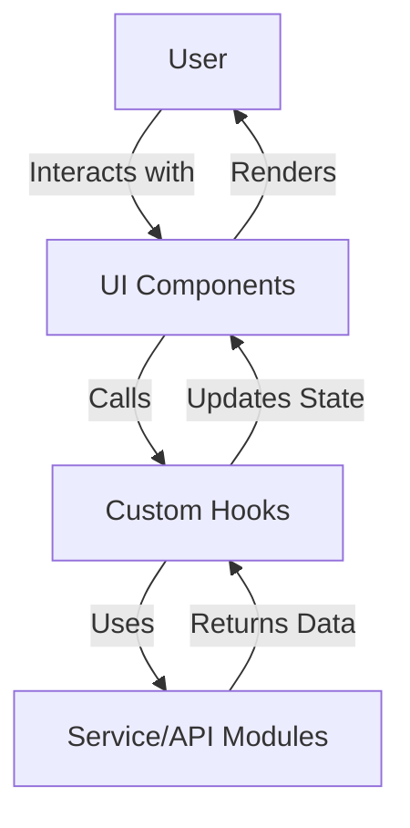
This diagram shows the top-down flow: user interactions trigger UI component logic, which delegates data fetching and state management to custom hooks, which in turn call service or API modules. Data flows back up for UI rendering.  
Sources: [src/hooks/use-analytics.ts:1-73](), [src/components/dashboard.tsx](), [src/services/auth-service.ts:1-78]()

---

## Core Technologies and Tooling

| Technology                | Purpose                                     |
|---------------------------|---------------------------------------------|
| React + TypeScript + Vite | UI framework and build tooling              |
| Tailwind CSS / Bootstrap  | Styling and responsive layout               |
| ESLint                    | Code linting and quality                    |
| Axios                     | HTTP client for API communication           |
| FontAwesome               | Iconography                                 |
| React Hook Form, Yup      | Form handling and validation                |
| Mock APIs                 | Simulated backend for development/testing    |

Sources: [README.md:1-40](), [package.json:1-61]()

---

## Analytics Module

### Purpose

The analytics module provides dashboard statistics, top products, top customers, top sellers, and hourly sales. It uses mock APIs for demonstration and development.

### Key Data Structures

```typescript
export interface SalesStats {
    billing: number
    sales: number
    averageTicket: number
    profit: number
    salesRate: number
    paymentMethodPercentage: number
    bestMonth: string
}

export interface AnalyticsPeriod {
    today: SalesStats
    yesterday: SalesStats
    thisWeek: SalesStats
    thisMonth: SalesStats
}
```
Sources: [src/types/analytics.ts:1-40]()

### Data Fetching Flow

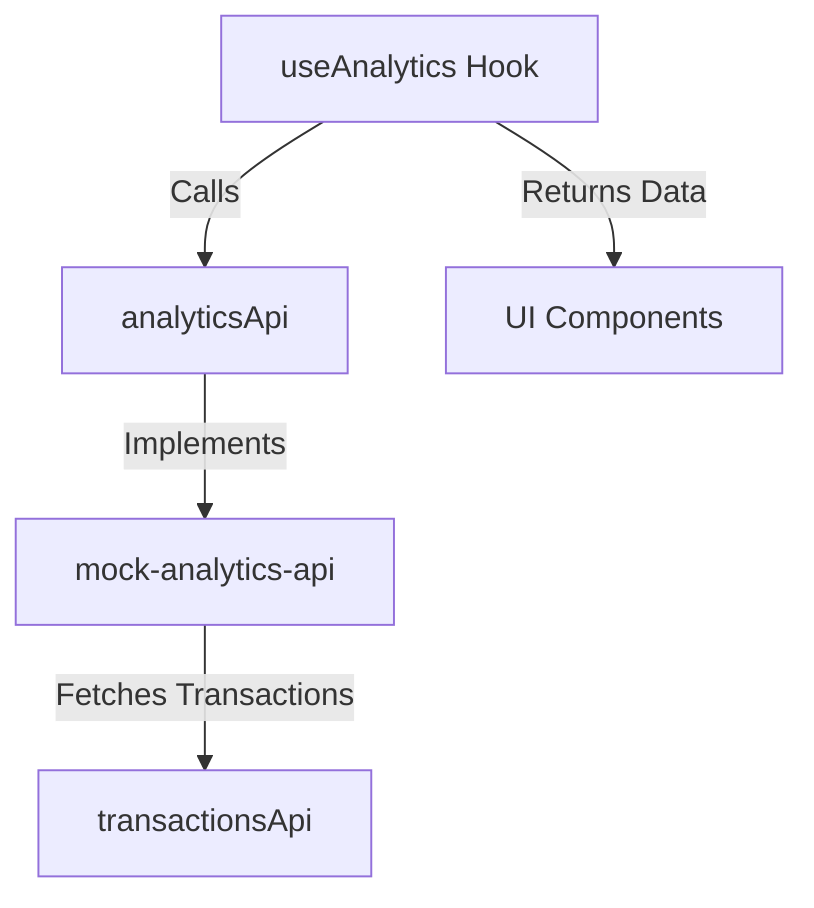
This flow describes how analytics data is fetched and made available to UI components via the `useAnalytics` hook.  
Sources: [src/hooks/use-analytics.ts:1-73](), [src/lib/mock-analytics-api.ts:1-80]()

### Example: useAnalytics Hook

```typescript
export function useAnalytics(userId?: string) {
  const [analytics, setAnalytics] = useState<AnalyticsPeriod | null>(null)
  // ...
  const fetchAnalytics = async (date: Date = new Date(), filterUserId?: string) => {
    const [analyticsData, productsData, customersData, sellersData, hourlyData] = await Promise.all([
      analyticsApi.getAnalytics(date, filterUserId),
      analyticsApi.getTopProducts(5, filterUserId),
      analyticsApi.getTopCustomers(5, filterUserId),
      analyticsApi.getTopSellers(),
      analyticsApi.getHourlySales(date, filterUserId),
    ])
    // ...
  }
  // ...
}
```
Sources: [src/hooks/use-analytics.ts:1-73]()

---

## User Management Module

### Purpose

User management enables creating, updating, deleting, and toggling the status of users, as well as assigning roles and permissions. The system supports multiple roles, each with specific capabilities.

### Role Hierarchy & Permissions

| Role         | Permissions (examples)                    |
|--------------|-------------------------------------------|
| Propietario  | Full system access                        |
| Administrador| Most admin features except finances       |
| Cajero       | Limited to sales, orders, customers       |
| Almacenista  | Inventory, stock, suppliers, reports      |
| Usuario      | Read-only access to products, customers   |

Sources: [src/lib/mock-users-api.ts:1-80](), [src/components/usuarios/user-management.tsx:1-100]()

### User Management Flow

```mermaid
graph TD
    A[User Management UI]
    B[use-users Hook]
    C[usersApi (mock)]
    D[User Data State]

    A -->|User actions| B
    B -->|API Calls| C
    C -->|Returns| B
    B -->|Updates| D
    D -->|Re-renders| A
```
This diagram shows the user management data flow from UI actions to API calls and state updates.  
Sources: [src/components/usuarios/user-management.tsx:1-100](), [src/lib/mock-users-api.ts:1-80](), [src/hooks/use-users.ts]()

### Example: Mock User API

```typescript
export const usersApi = {
  async getUsers(): Promise<User[]> {
    await delay(500)
    return [...mockUsers]
  },
  async getUserById(id: string): Promise<User | null> {
    await delay(300)
    return mockUsers.find((user) => user.id === id) || null
  },
  // ...
}
```
Sources: [src/lib/mock-users-api.ts:1-80]()

---

## Authentication and Profile Handling

### Overview

Authentication is handled via API calls to endpoints such as `/v1/auth/sign-up` and `/v1/auth/profile`. Upon successful registration or login, a token is stored and used for subsequent authenticated requests.

### Sequence Diagram: Fetching User Profile

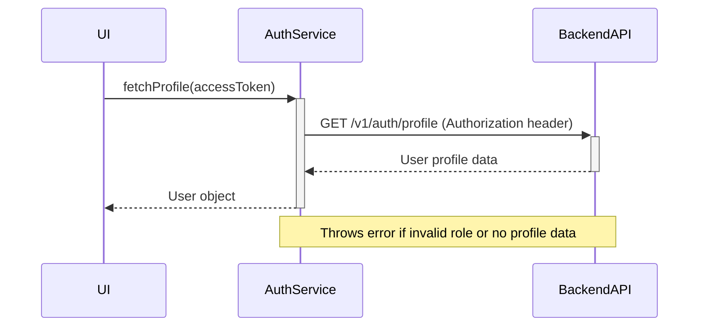
This diagram outlines the process of fetching the authenticated user's profile.  
Sources: [src/services/auth-service.ts:1-78]()

### Example: Profile Fetching Code

```typescript
export const fetchProfile = async (accessToken: string): Promise<User> => {
  const profileResponse = await axios.get(api + "/v1/auth/profile", {
    headers: { Authorization: `Bearer ${accessToken}` },
  });
  // ...parse and validate profileData...
  return user;
}
```
Sources: [src/services/auth-service.ts:30-60]()

---

## Dashboard and Main UI Components

### Dashboard Layout

The dashboard component orchestrates the main UI, including the sidebar, header, product section, and analytics display. It leverages hooks for data and state management.

#### UI Structure Diagram

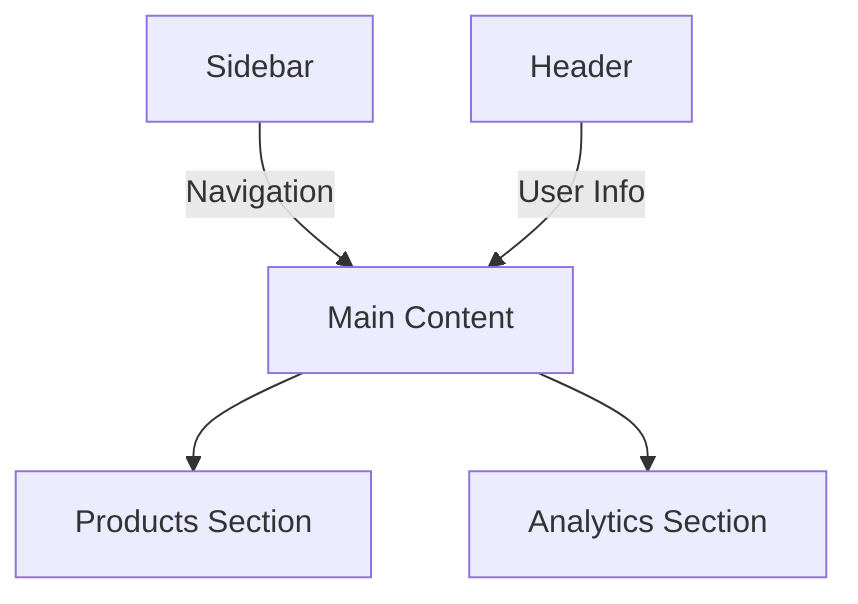
This structure provides a clear separation of navigation, user info, and business data display.  
Sources: [src/components/dashboard.tsx]()

---

## Key Data Models

### AnalyticsPeriod and SalesStats

| Field                    | Type      | Description                                    |
|--------------------------|-----------|------------------------------------------------|
| billing                  | number    | Total billing amount for period                |
| sales                    | number    | Number of sales transactions                   |
| averageTicket            | number    | Average ticket value                           |
| profit                   | number    | Calculated profit (demo: 30% margin)           |
| salesRate                | number    | Sales rate (demo calculation)                  |
| paymentMethodPercentage  | number    | Payment method distribution (demo value)       |
| bestMonth                | string    | Best performing month (demo value)             |

Sources: [src/types/analytics.ts:1-40]()

---

## Example: ESLint and TypeScript Configuration

```js
export default tseslint.config({
  extends: [
    ...tseslint.configs.recommendedTypeChecked,
    ...tseslint.configs.strictTypeChecked,
    ...tseslint.configs.stylisticTypeChecked,
  ],
  languageOptions: {
    parserOptions: {
      project: ['./tsconfig.node.json', './tsconfig.app.json'],
      tsconfigRootDir: import.meta.dirname,
    },
  },
})
```
This configuration ensures code quality and type safety for production development.  
Sources: [README.md:10-40]()

---

## Summary

This project delivers a modular, type-safe POS management frontend with robust analytics, user management, and authentication features. Its architecture, based on React and TypeScript, emphasizes separation of concerns, scalability, and developer productivity. With mock APIs and strong typing, the codebase is well-suited for both rapid prototyping and extension towards real-world production use.

Sources: [README.md](), [package.json](), [src/hooks/use-analytics.ts](), [src/lib/mock-analytics-api.ts](), [src/types/analytics.ts](), [src/components/dashboard.tsx](), [src/components/usuarios/user-management.tsx](), [src/services/auth-service.ts](), [src/services/user-service.ts](), [src/lib/mock-users-api.ts]()

---

<a id='page-2'></a>

## Getting Started

### Related Pages

Related topics: [Project Introduction](#page-1)

<details>
<summary>Relevant source files</summary>

The following files were used as context for generating this wiki page:

- [README.md](README.md)
- [package.json](package.json)
- [vite.config.ts](vite.config.ts)
- [tsconfig.app.json](tsconfig.app.json)
- [tsconfig.node.json](tsconfig.node.json)
</details>

# Getting Started

This page provides a comprehensive guide to getting started with the posmad frontend project, a React + TypeScript application bootstrapped with Vite. The setup emphasizes modern development practices, including hot module replacement (HMR), ESLint integration, and a modular configuration supporting both development and production workflows. The following guide covers environment setup, configuration, and the architectural foundation necessary to begin contributing or deploying the application.

For more details on specific aspects such as [ESLint Configuration](#eslint-configuration), [Vite Setup](#vite-setup), and [TypeScript Configuration](#typescript-configuration), see the corresponding sections below.

---

## Project Overview

The posmad frontend leverages the following core technologies:

| Technology      | Purpose                                  |
|-----------------|------------------------------------------|
| React           | UI framework                             |
| TypeScript      | Static typing for JavaScript             |
| Vite            | Development server & build tool          |
| ESLint          | Code linting and style enforcement       |
| Bootstrap/Tailwind| Styling and UI components              |

Sources: [README.md:1-43](), [package.json:1-65]()

---

## Installation and Setup

### Prerequisites

- Node.js (version not specified; ensure compatibility with Vite and dependencies)
- npm or yarn

### Steps

1. **Install dependencies:**

   ```bash
   npm install
   ```
   Sources: [README.md:1-3](), [package.json:1-65]()

2. **Run the development server:**

   ```bash
   npm run dev
   ```
   - This starts Vite's dev server with hot module replacement enabled.

   Sources: [package.json:5-13](), [vite.config.ts:1-17]()

3. **Build for production:**

   ```bash
   npm run build
   ```
   - Runs the TypeScript compiler and then builds the app using Vite.

   Sources: [package.json:5-13]()

4. **Preview the production build:**

   ```bash
   npm run preview
   ```
   - Serves the production build locally for testing.

   Sources: [package.json:5-13]()

---

## Project Structure

Below is a high-level overview of the project’s structure and configuration files:

```plaintext
/
├── src/                   # Source code
├── package.json           # Project metadata and dependencies
├── vite.config.ts         # Vite configuration
├── tsconfig.app.json      # TypeScript config for the app
├── tsconfig.node.json     # TypeScript config for node scripts
├── README.md              # Project documentation
```

Sources: [README.md:1-43](), [package.json:1-65](), [vite.config.ts:1-17](), [tsconfig.app.json:1-33](), [tsconfig.node.json:1-27]()

---

## Vite Setup

The project uses Vite as its build tool and dev server, configured for React with TypeScript.

### Configuration Highlights

- **Plugin:** `@vitejs/plugin-react` enables React Fast Refresh for HMR.
- **Alias:** `@` is aliased to `/src` for simpler imports.
- **Server:** Runs on port 3000 and opens automatically.

#### vite.config.ts Excerpt

```typescript
import { defineConfig } from 'vite'
import react from '@vitejs/plugin-react'

export default defineConfig({
  plugins: [react()],
  resolve: {  
    alias: {
      "@": "/src",
    },
  },
  server: {
    port: 3000,
    open: true,
  },
})
```

Sources: [vite.config.ts:1-17]()

#### Mermaid Diagram: Build and Dev Server Flow

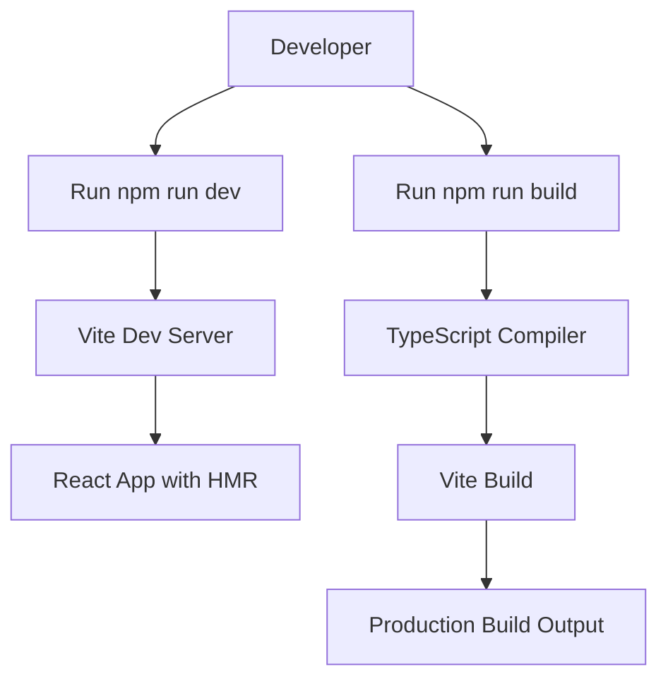
This diagram illustrates how running the dev or build scripts initiates the respective Vite workflows.
Sources: [vite.config.ts:1-17](), [package.json:5-13]()

---

## TypeScript Configuration

The project uses two separate TypeScript configuration files for different purposes:

| File                | Purpose                                           |
|---------------------|--------------------------------------------------|
| tsconfig.app.json   | Main app source code (`src/`), React JSX support |
| tsconfig.node.json  | Node-specific scripts, build info, strict lint   |

### tsconfig.app.json Key Options

- `"jsx": "react-jsx"`: Enables React JSX transform.
- `"strict": true`: Enforces strict type checking.
- `"noEmit": true`: TypeScript does not emit output, used with Vite.
- `"lib": ["ES2020", "DOM", "DOM.Iterable"]`: Enables latest JS and browser APIs.

Sources: [tsconfig.app.json:1-33]()

### tsconfig.node.json Key Options

- `"target": "ES2022"` and `"lib": ["ES2023"]`: Modern JavaScript features.
- `"moduleResolution": "bundler"`: Optimized for bundler environments.
- `"noEmit": true`: Prevents output, only type-checks.
- Additional strict linting flags.

Sources: [tsconfig.node.json:1-27]()

#### Mermaid Diagram: TypeScript Config Usage

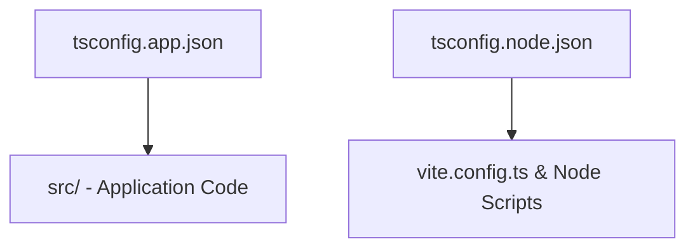
This shows how each config targets different parts of the project.
Sources: [tsconfig.app.json:1-33](), [tsconfig.node.json:1-27]()

---

## ESLint Configuration

The project includes ESLint for code quality and style checks. The README provides guidance for expanding ESLint with type-aware rules and React-specific plugins.

### Key Plugins and Rules

| Plugin/Config                 | Purpose                                 |
|-------------------------------|-----------------------------------------|
| `@eslint/js`                  | Core ESLint rules                       |
| `eslint-plugin-react-hooks`   | React hooks rules                       |
| `eslint-plugin-react-refresh` | React Fast Refresh linting              |
| `@vitejs/plugin-react`        | Integrates React with Vite              |

#### Extending ESLint

The README suggests using `@typescript-eslint` configs for stricter type checks and optionally adding `eslint-plugin-react-x` and `eslint-plugin-react-dom` for React-specific linting.

#### Example ESLint Config Snippet

```js
export default tseslint.config({
  extends: [
    ...tseslint.configs.recommendedTypeChecked,
    ...tseslint.configs.strictTypeChecked,
    ...tseslint.configs.stylisticTypeChecked,
  ],
  languageOptions: {
    parserOptions: {
      project: ['./tsconfig.node.json', './tsconfig.app.json'],
      tsconfigRootDir: import.meta.dirname,
    },
  },
})
```
Sources: [README.md:8-43](), [package.json:27-65]()

---

## Dependency Overview

Below is a summary table of key dependencies and their roles:

| Dependency                    | Version      | Purpose                          |
|-------------------------------|--------------|----------------------------------|
| react, react-dom              | ^19.1.0      | Core UI library                  |
| @vitejs/plugin-react          | ^4.4.1       | React integration with Vite      |
| typescript                    | ~5.8.3       | Static typing                    |
| eslint, @eslint/js            | ^9.25.0      | Linting and code quality         |
| bootstrap, react-bootstrap    | ^5.3.6, ^2.10.10 | UI styling and components   |
| tailwind-merge                | ^3.3.0       | Tailwind utility class merging   |
| axios                         | ^1.9.0       | HTTP requests                    |

Sources: [package.json:14-65]()

---

## Scripts

| Script      | Command               | Description                                 |
|-------------|-----------------------|---------------------------------------------|
| dev         | `vite`                | Start development server with HMR           |
| build       | `tsc -b && vite build`| Type-check then build for production        |
| lint        | `eslint .`            | Run ESLint on all files                     |
| preview     | `vite preview`        | Serve built app locally for preview         |

Sources: [package.json:5-13]()

---

## Summary

The posmad frontend project provides a modern, well-structured foundation for building scalable React applications with TypeScript. The integration of Vite ensures fast development and optimized builds, while the use of strict TypeScript and ESLint configurations enforces code quality and maintainability. By following the setup and configuration steps outlined above, developers can quickly get the project running and begin contributing with confidence.

Sources: [README.md](), [package.json](), [vite.config.ts](), [tsconfig.app.json](), [tsconfig.node.json]()

---

<a id='page-3'></a>

## Architecture Overview

### Related Pages

Related topics: [Component Relationship Diagram](#page-4), [Data Flow and State Management](#page-9)

<details>
<summary>Relevant source files</summary>

The following files were used as context for generating this wiki page:

- [src/App.tsx](src/App.tsx)
- [src/contexts/app-provider.tsx](src/contexts/app-provider.tsx)
- [src/contexts/auth-context.tsx](src/contexts/auth-context.tsx)
- [src/contexts/user-context.tsx](src/contexts/user-context.tsx)
- [src/contexts/product-context.tsx](src/contexts/product-context.tsx)
- [src/contexts/cart-context.tsx](src/contexts/cart-context.tsx)
</details>

# Architecture Overview

## Introduction

This page provides a comprehensive overview of the architecture of the posmad frontend application. The architecture leverages React with TypeScript, utilizing a modular context-based approach for state management, encapsulation of authentication, user, product, and cart logic. Routing is managed with React Router, and the application structure is organized for scalability and maintainability. This document details the major architectural components, their responsibilities, and the interactions between them.

Sources: [src/App.tsx](), [src/contexts/app-provider.tsx](), [src/contexts/auth-context.tsx](), [src/contexts/user-context.tsx](), [src/contexts/product-context.tsx](), [src/contexts/cart-context.tsx]()

---

## Application Structure

### High-Level Component and Provider Hierarchy

The root of the application is defined in `src/App.tsx`, which sets up routing and wraps the application in several context providers. The provider hierarchy ensures global state and logic are accessible throughout the component tree.

#### Main Provider and Routing Structure

```tsx
function App() {
  return (
    <Router>
      <AuthProvider>
        <UserProvider>
          <AppProvider>
            <Suspense fallback={<Loading />}>
              <Routes>
                {/* ...route definitions... */}
              </Routes>
            </Suspense>
          </AppProvider>
        </UserProvider>
      </AuthProvider>
    </Router>
  )
}
```
Sources: [src/App.tsx:11-41]()

#### Mermaid Diagram: Application Root Hierarchy

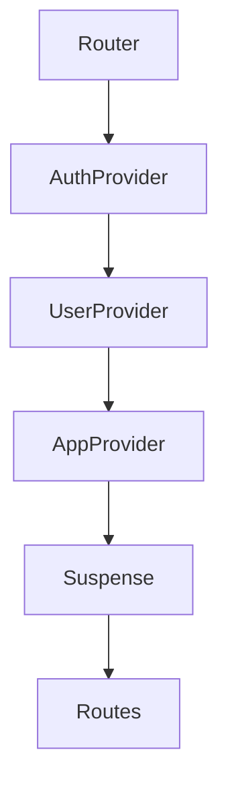
This diagram shows the top-down composition of providers and routing. The `AuthProvider`, `UserProvider`, and `AppProvider` wrap the app to provide global state and logic.

Sources: [src/App.tsx:11-41]()

---

## Context Providers

Context providers encapsulate domain-specific logic and state, making them accessible throughout the component tree.

### AuthProvider

Manages authentication state, user session, and provides authentication-related methods and state to the rest of the app.

#### Key Responsibilities

- Handles user login/logout.
- Stores authentication status and user info.
- Exposes authentication-related context values.

#### Example Code Snippet

```tsx
const AuthContext = createContext<AuthContextType | undefined>(undefined);

export function AuthProvider({ children }: { children: ReactNode }) {
  // ... authentication state and logic ...
  return (
    <AuthContext.Provider value={value}>
      {children}
    </AuthContext.Provider>
  );
}
```
Sources: [src/contexts/auth-context.tsx:1-50]()

---

### UserProvider

Manages user-related data and operations, such as fetching user lists or individual user details.

#### Key Responsibilities

- Stores user information.
- Provides methods to fetch and update user data.

#### Example Code Snippet

```tsx
const UserContext = createContext<UserContextType | undefined>(undefined);

export function UserProvider({ children }: { children: ReactNode }) {
  // ... user state and logic ...
  return (
    <UserContext.Provider value={value}>
      {children}
    </UserContext.Provider>
  );
}
```
Sources: [src/contexts/user-context.tsx:1-50]()

---

### AppProvider

Acts as a global provider for application-level state and configuration.

#### Key Responsibilities

- Provides application-wide settings or state.
- Encapsulates logic that does not fit into more specific domains.

#### Example Code Snippet

```tsx
const AppContext = createContext<AppContextType | undefined>(undefined);

export function AppProvider({ children }: { children: ReactNode }) {
  // ... app-wide state and logic ...
  return (
    <AppContext.Provider value={value}>
      {children}
    </AppContext.Provider>
  );
}
```
Sources: [src/contexts/app-provider.tsx:1-50]()

---

### ProductProvider

Manages product catalog state, including product lists, categories, and product-related operations.

#### Key Responsibilities

- Stores and updates product data.
- Provides access to product lists and details.

#### Example Code Snippet

```tsx
const ProductContext = createContext<ProductContextType | undefined>(undefined);

export function ProductProvider({ children }: { children: ReactNode }) {
  // ... product state and logic ...
  return (
    <ProductContext.Provider value={value}>
      {children}
    </ProductContext.Provider>
  );
}
```
Sources: [src/contexts/product-context.tsx:1-50]()

---

### CartProvider

Manages the shopping cart state and logic.

#### Key Responsibilities

- Stores cart items.
- Provides methods to add, remove, and update cart contents.
- Calculates totals and manages cart operations.

#### Example Code Snippet

```tsx
const CartContext = createContext<CartContextType | undefined>(undefined);

export function CartProvider({ children }: { children: ReactNode }) {
  // ... cart state and logic ...
  return (
    <CartContext.Provider value={value}>
      {children}
    </CartContext.Provider>
  );
}
```
Sources: [src/contexts/cart-context.tsx:1-50]()

---

## Data Flow and Component Interactions

### Flow of Data Between Providers and Components

The following diagram illustrates how data and actions flow between the main context providers and their consumers (components).

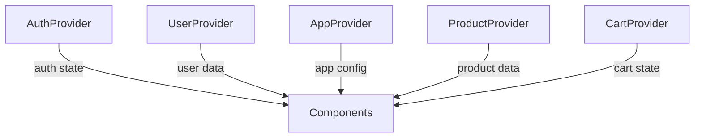
Components consume context via React's `useContext` hook, receiving state and actions provided by each context.

Sources: [src/App.tsx](), [src/contexts/*]()

---

## Routing Structure

### Route Definitions

The application uses React Router to define routes for various pages, including authentication, product management, transactions, user management, and dashboard.

#### Route Table

| Path                  | Component              | Description                      |
|-----------------------|-----------------------|----------------------------------|
| `/`                   | LoginPage             | Login screen                     |
| `/user`               | UsersPage             | User management                  |
| `/transaciones`       | Transaciones          | Transactions page                |
| `/productos`          | ProductsPage          | Product management               |
| `/productos/addProduct` | AddProduct           | Add new product                  |
| `/historia-ventas`    | HistorialVentas       | Sales history                    |
| `/dashboard`          | DashboardLayout       | Main dashboard (protected)       |

Sources: [src/App.tsx:18-37]()

#### Mermaid Diagram: Routing

```mermaid
graph TD
  Start["/"] --> LoginPage
  "/user" --> UsersPage
  "/transaciones" --> Transaciones
  "/productos" --> ProductsPage
  "/productos/addProduct" --> AddProduct
  "/historia-ventas" --> HistorialVentas
  "/dashboard" --> DashboardLayout
```
Sources: [src/App.tsx:18-37]()

---

## Summary Table: Key Context Providers

| Provider         | File                           | Main Purpose                        |
|------------------|-------------------------------|-------------------------------------|
| AuthProvider     | src/contexts/auth-context.tsx  | Authentication/session management   |
| UserProvider     | src/contexts/user-context.tsx  | User data and operations            |
| AppProvider      | src/contexts/app-provider.tsx  | App-wide state/configuration        |
| ProductProvider  | src/contexts/product-context.tsx | Product catalog/state management  |
| CartProvider     | src/contexts/cart-context.tsx  | Shopping cart state/logic           |

Sources: [src/contexts/app-provider.tsx](), [src/contexts/auth-context.tsx](), [src/contexts/user-context.tsx](), [src/contexts/product-context.tsx](), [src/contexts/cart-context.tsx]()

---

## Conclusion

The posmad frontend architecture is organized around modular context providers that encapsulate authentication, user, product, cart, and global application logic. These providers, composed at the root of the application, ensure clean separation of concerns and facilitate scalable state management. Routing is handled declaratively, mapping application features to distinct URL paths and components. This structure enables robust, maintainable, and extensible frontend development.

Sources: [src/App.tsx](), [src/contexts/app-provider.tsx](), [src/contexts/auth-context.tsx](), [src/contexts/user-context.tsx](), [src/contexts/product-context.tsx](), [src/contexts/cart-context.tsx]()

---

<a id='page-4'></a>

## Component Relationship Diagram

### Related Pages

Related topics: [Architecture Overview](#page-3), [UI Components and Layout](#page-10)

<details>
<summary>Relevant source files</summary>

The following files were used as context for generating this wiki page:

- [src/App.tsx](src/App.tsx)
- [src/components/layout/sidebar.tsx](src/components/layout/sidebar.tsx)
- [src/components/dashboard.tsx](src/components/dashboard.tsx)
- [src/components/historia-ventas/record-ventas.tsx](src/components/historia-ventas/record-ventas.tsx)
- [src/pages/ventasH.tsx](src/pages/ventasH.tsx)
</details>

# Component Relationship Diagram

## Introduction

The "Component Relationship Diagram" page provides a comprehensive technical overview of the main React component relationships and their data flows within the posmad application. This documentation focuses on the interaction between core UI components such as the Dashboard, Sidebar, Sales History, and the main App routing logic. The goal is to clarify how these components are structured, how they communicate, and how they fit into the overall user experience and application architecture.

This page is intended to serve as a reference for developers seeking to understand or extend the application's main UI and navigation structure. For related topics, see the [User Management](#user-management) or [Sales Analytics](#sales-analytics) pages (if available).

## Application Architecture Overview

The application is structured around a main App component that sets up routing and context providers. The UI is divided into main functional areas such as Dashboard, Products, Transactions, Sales History, and User Management, each accessible via the Sidebar navigation. Components are organized to support role-based access and dynamic content rendering.

### High-Level Component Flow

The following Mermaid diagram illustrates the top-level relationships and navigation flow between the core components:

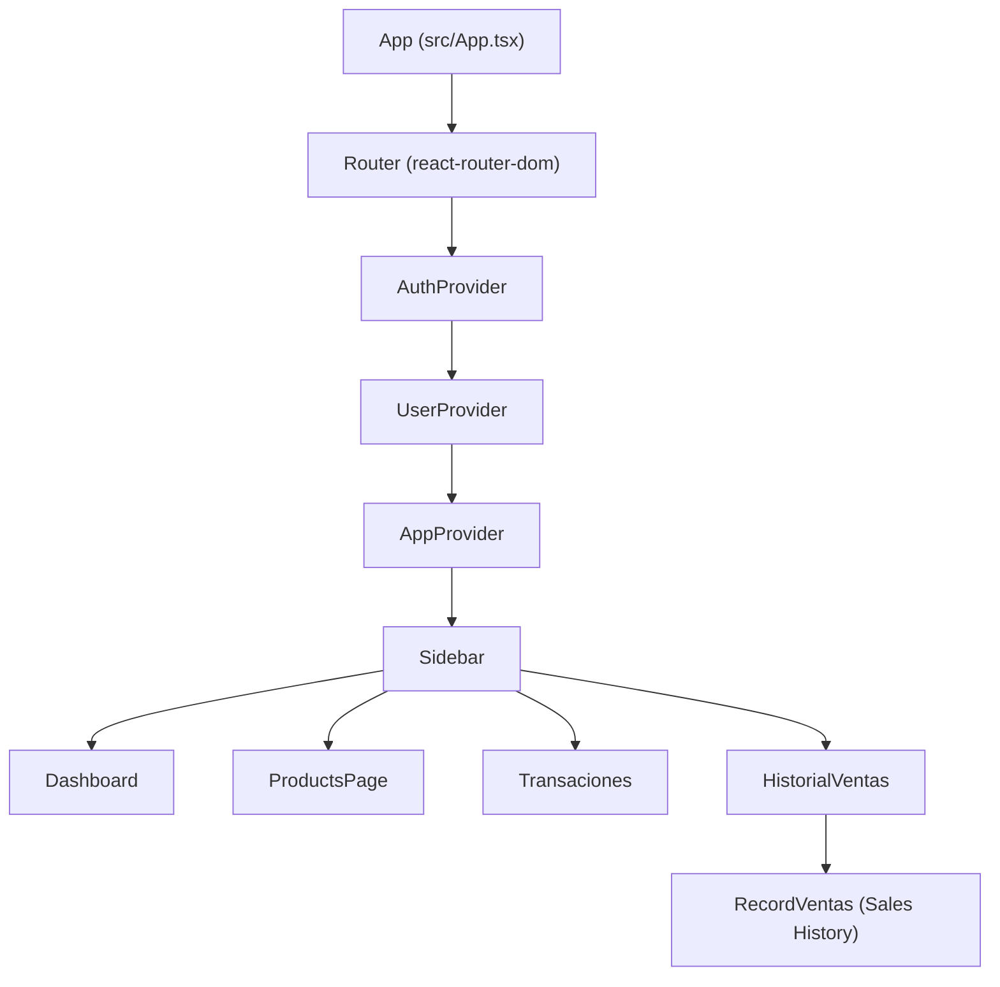
This diagram shows the nested context providers and the routing to main pages/components, all initiated from the `App` component.  
Sources: [src/App.tsx:1-53](), [src/components/layout/sidebar.tsx:1-83](), [src/pages/ventasH.tsx:1-25]()

### Component and Feature Table

| Component/Page     | Description                                                        | Main Dependencies             | Source File                              |
|--------------------|--------------------------------------------------------------------|-------------------------------|------------------------------------------|
| App                | Main entry point, sets up routing and providers                    | React Router, Providers       | src/App.tsx                              |
| Sidebar            | Navigation sidebar with role-based menu items                      | Auth Context, React Router    | src/components/layout/sidebar.tsx         |
| Dashboard          | Main sales and product dashboard UI                                | Product/Cart/User Contexts    | src/components/dashboard.tsx              |
| RecordVentas       | Sales history page with search/filter for sales records            | useSalesHistory, useUsers     | src/components/historia-ventas/record-ventas.tsx |
| HistorialVentas    | Wrapper for RecordVentas, with admin role guard                    | Auth Context, Sidebar         | src/pages/ventasH.tsx                    |
Sources: [src/App.tsx:1-53](), [src/components/layout/sidebar.tsx:1-83](), [src/components/dashboard.tsx:1-130](), [src/components/historia-ventas/record-ventas.tsx:1-64](), [src/pages/ventasH.tsx:1-25]()

## Main App Routing and Context Providers

### App Component Structure

The `App` component wraps the entire application in authentication, user, and application context providers. It defines routes for all main pages, including Dashboard, Products, Transactions, User Management, and Sales History.

```javascript
function App() {
  return (
    <Router>
      <AuthProvider>
        <UserProvider>
        <AppProvider>
          <Suspense fallback={<Loading />}>
            <Routes>
              {/* Public routes */}
              <Route path="/" element={<LoginPage />} />
              <Route path="/user" element={<UsersPage />} />
              <Route path="/transaciones" element={<Transaciones />} />
              <Route path="/productos" element={<ProductsPage />} />
              <Route path="/productos/addProduct" element={<AddProduct />} />
              <Route path="/historia-ventas" element={<HistorialVentas />} />
              {/* Protected routes */}
              <Route path="/dashboard" element={<DashboardLayout />}>
                <Route index element={<HomePage />} />
              {/* ... */}
            </Routes>
          </Suspense>
        </AppProvider>
        </UserProvider>
      </AuthProvider>
    </Router>
  )
}
```
This setup ensures all child components have access to authentication and user state, and that navigation is handled via React Router.  
Sources: [src/App.tsx:1-53]()

### Mermaid: Routing Flow

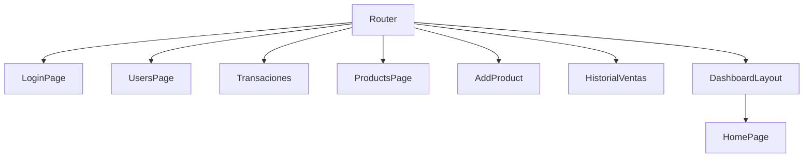
This diagram depicts the main routing configuration and page entry points.  
Sources: [src/App.tsx:1-53]()

## Sidebar Navigation and Role-Based Access

### Sidebar Menu Items

The Sidebar component defines its menu based on user roles, using the `useAuth` context and constants from `ROLES`. Each menu item includes a route, icon, label, and allowed roles.

```javascript
const menuItems = [
  {
    href: "/dashboard",
    icon: "fa-check-circle",
    label: "Vender",
    roles: [ROLES.ADMIN, ROLES.CAJERO, ROLES.ALMACENISTA, ROLES.PROPIETARIO, ROLES.USER],
    highlight: true,
    tooltip: "Vender",
  },
  {
    href: "/productos",
    icon: "fa-light fa-boxes-stacked", 
    label: "Productos",
    roles: [ROLES.ADMIN, ROLES.CAJERO, ROLES.ALMACENISTA, ROLES.PROPIETARIO, ROLES.USER],
    tooltip: "Productos",
  },
  {
    href: "/historia-ventas",
    icon: "fa-brands fa-sellcast",
    label: "Historia de Ventas",
    roles: [ROLES.ADMIN, ROLES.CAJERO],
    tooltip: "Historia de Ventas",
  },
  // ...
]
```
Role-based logic ensures that only users with the appropriate permissions see certain navigation items.  
Sources: [src/components/layout/sidebar.tsx:9-54]()

### Mermaid: Sidebar Navigation

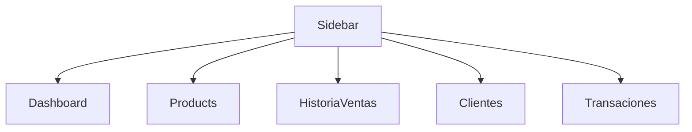
This diagram shows the navigation links available from the Sidebar, subject to user role.  
Sources: [src/components/layout/sidebar.tsx:9-54]()

## Dashboard Component Structure

### Dashboard Layout

The Dashboard is a central component for point-of-sale activities. It displays product listings, a shopping cart, and user information. It consumes context from product, cart, and user providers.

#### Main Features:
- Sidebar navigation (left)
- Header with user profile and help
- Product listing area
- Cart and checkout sidebar

#### Code Snippet: Dashboard Context Usage

```javascript
const {
  filteredProducts,
  categories,
  loading,
  error,
  searchQuery,
  setSearchQuery,
  selectedCategory,
  setSelectedCategory,
} = useProducts()

const { cart, addToCart, removeFromCart, updateQuantity, clearCart, cartTotal, isCartOpen, setIsCartOpen } = useCart()

const { customerName, userProfile } = useUser()
```
These hooks provide state and actions for products, cart, and user info in the dashboard.  
Sources: [src/components/dashboard.tsx:41-60]()

### Mermaid: Dashboard Internal Structure

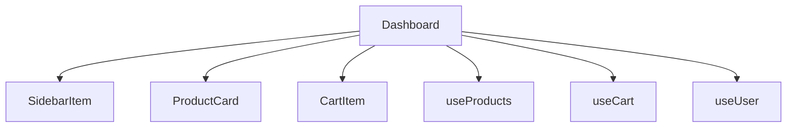
This diagram shows the main subcomponents and context hooks used within Dashboard.  
Sources: [src/components/dashboard.tsx:41-130]()

## Sales History (Historial de Ventas) Component

### Component Flow

The `HistorialVentas` page wraps the `RecordVentas` component with a role guard, ensuring only admins can access sales history. It uses the Sidebar for navigation and passes control to RecordVentas for actual data rendering.

#### Code Snippet: HistorialVentas Role Guard

```javascript
export default function HistorialVentas() {
  const { hasPermission } = useAuth()
  const isAdmin = hasPermission(ROLES.ADMIN)

  return (
    <>   
      {isAdmin && ( 
        <div>
          <div className="d-flex flex-grow-1 overflow-hidden">
            <Sidebar />
            <div className="flex-grow-1  p-4" style={{transition: "margin-left 0.3s ease"}}>
              <RecordVentas/>                     
            </div>
          </div>
        </div>
      )}
    </>
  )
}
```
This ensures that only authorized users can view the sales history page.  
Sources: [src/pages/ventasH.tsx:1-25]()

### RecordVentas Data Flow

The `RecordVentas` component fetches and filters sales history data, provides search/filter UI, and lists sales records. It uses hooks like `useSalesHistory` and `useUsers` for data, and a role guard for access control.

#### Mermaid: Sales History Data Flow

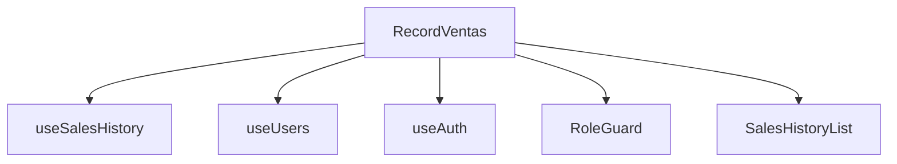
This diagram represents the dependencies and data flow within the sales history feature.  
Sources: [src/components/historia-ventas/record-ventas.tsx:1-64]()

## Component Integration Sequence

### Sequence Diagram: User Navigates to Sales History

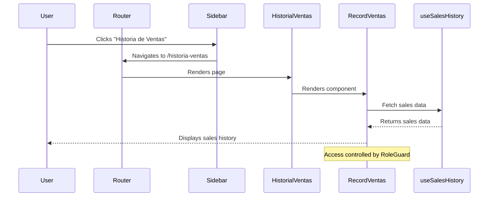
This sequence shows the flow from user interaction to data fetching and rendering of the sales history page.  
Sources: [src/App.tsx:1-53](), [src/components/layout/sidebar.tsx:9-54](), [src/pages/ventasH.tsx:1-25](), [src/components/historia-ventas/record-ventas.tsx:1-64]()

## Conclusion

The component relationships in the posmad application are organized around a clear hierarchy of providers, routing, and role-based UI rendering. The Sidebar acts as a central navigation hub, with access to features controlled by user roles. Context hooks provide modular state management for products, cart, users, and sales history, ensuring a cohesive and maintainable architecture. This diagrammatic overview serves as a foundation for understanding, maintaining, and extending the application's main features.

Sources: [src/App.tsx](), [src/components/layout/sidebar.tsx](), [src/components/dashboard.tsx](), [src/components/historia-ventas/record-ventas.tsx](), [src/pages/ventasH.tsx]()

---

<a id='page-5'></a>

## Authentication and Authorization

### Related Pages

Related topics: [UI Components and Layout](#page-10), [Extensibility and Customization](#page-13)

<details>
<summary>Relevant source files</summary>

The following files were used as context for generating this wiki page:

- [src/services/auth-service.ts](src/services/auth-service.ts)
- [src/contexts/auth-context.tsx](src/contexts/auth-context.tsx)
- [src/types/User.ts](src/types/User.ts)
- [src/types/roles.ts](src/types/roles.ts)
- [src/services/user-service.ts](src/services/user-service.ts)
- [src/pages/login.tsx](src/pages/login.tsx)
- [src/components/usuarios/user-management.tsx](src/components/usuarios/user-management.tsx)
- [src/lib/handleError.tsx](src/lib/handleError.tsx)
</details>

# Authentication and Authorization

## Introduction

Authentication and authorization are core features in this project, providing secure user access, role-based permissions, and session management. The system utilizes JWT tokens, role validation, and context-driven state management to ensure only authorized users can access protected resources and actions. User credentials are managed through API endpoints, with user roles determining access to various parts of the application.

This page details the architecture, components, data flow, and implementation of authentication and authorization, referencing key source files from the codebase.

## Architecture Overview

The authentication and authorization system consists of several interconnected components:

- **API Service Layer**: Handles authentication requests, profile retrieval, and token management.
- **Auth Context**: Provides global authentication state and actions via React context.
- **Role Management**: Defines user roles, mappings, and permissions.
- **User Service**: Handles user CRUD operations with authorization checks.
- **UI Integration**: Controls protected routes and UI elements based on user roles.

Below is a high-level architecture diagram:

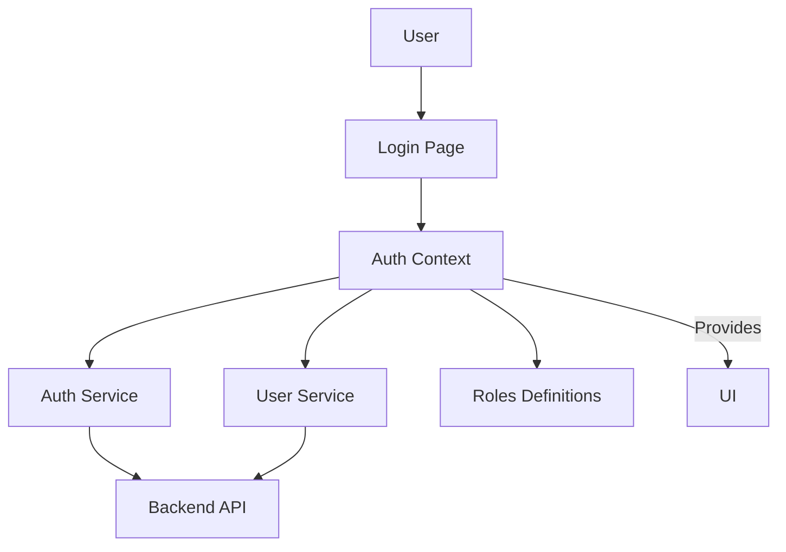
*This diagram shows the flow from user interaction to authentication, authorization, and protected UI rendering.*
Sources: [src/services/auth-service.ts](), [src/contexts/auth-context.tsx](), [src/types/roles.ts](), [src/services/user-service.ts]()

---

## API Service Layer

### Key Functions

- `loginAPI(email, password)`: Authenticates the user and retrieves an access token.
- `fetchProfile(accessToken)`: Retrieves user profile using the provided token.
- `registerAPI(fullname, email, role, enable)`: Registers a new user and stores a token.
- Error handling via `handleError`.

```typescript
export const loginAPI = async (email: string, password: string) => {
    // Authenticate to get token
    const loginResponse = await axios.post(api + "/v1/auth/sign-in", { email, password });
    const accessToken = loginResponse.data?.data?.accessToken || loginResponse.data?.accessToken || loginResponse.data?.token;
    if (!accessToken) throw new Error("No access token received from server");
    const user = await fetchProfile(accessToken);
    localStorage.setItem("token", accessToken);
    localStorage.setItem("user", JSON.stringify(user));
    axios.defaults.headers.common["Authorization"] = `Bearer ${accessToken}";
    return { accessToken, ...user };
}
```
Sources: [src/services/auth-service.ts:56-89]()

#### API Endpoints

| Endpoint              | Method | Purpose                  | Auth Required |
|-----------------------|--------|--------------------------|--------------|
| /v1/auth/sign-in      | POST   | Authenticate user        | No           |
| /v1/auth/profile      | GET    | Get user profile         | Yes          |
| /v1/auth/sign-up      | POST   | Register new user        | No           |
| /tokens               | POST   | Store token (local)      | No           |
| /v1/auth/sign-out     | POST   | Logout                   | Yes          |
| /v1/users             | GET    | List users               | Yes          |
| /v1/users             | POST   | Create user              | Yes          |

Sources: [src/services/auth-service.ts:16-119](), [src/services/user-service.ts:16-65]()

### Sequence Diagram: Login Flow

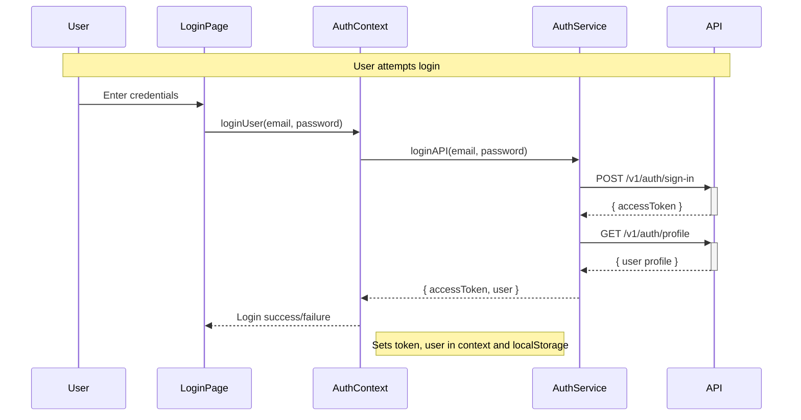
Sources: [src/services/auth-service.ts:56-89](), [src/contexts/auth-context.tsx:122-151](), [src/pages/login.tsx:35-67]()

---

## Auth Context and State Management

### AuthContext Structure

The authentication state and actions are managed globally using React Context:

```typescript
type AuthContextType = {
  user: User | null
  isLoading: boolean
  isAuthenticated: boolean
  userRole: typeof ROLES[keyof typeof ROLES] | null
  token: string | null
  setToken: (token: string | null) => void
  loginUser: (email: string, password: string) => void
  register: (name: string, email: string, password: string, role: string, enabled: boolean ) => Promise<boolean>
  logout: () => void
  hasPermission: (requiredRole: string | string[]) => boolean
  getAccessToken: () => string | null
}
```
Sources: [src/contexts/auth-context.tsx:28-42]()

#### State Initialization

- On load, retrieves user and token from `localStorage`.
- Sets `axios` default authorization header if token is present.
- Updates state on login, logout, or registration actions.

#### Role-Based Permission Check

```typescript
const hasPermission = (requiredRole: string | string[]): boolean => {
  if (!user?.role) return false
  if (Array.isArray(requiredRole)) {
    return requiredRole.includes(user.role)
  }
  return user.role === requiredRole
}
```
Sources: [src/contexts/auth-context.tsx:104-113]()

---

## Role Management

### Role Definitions and Utilities

Roles are centrally defined and mapped for consistency and authorization checks.

#### Role Constants

```typescript
export const ROLES = {
  ADMIN: "admin",
  CAJERO: "cajero",
  USER: "user",
  PROPIETARIO: "propietario",
  ALMACENISTA: "almacenista"
} as const
```
Sources: [src/types/roles.ts:1-7]()

#### Role Mapping

Maps API role strings to internal role constants:

```typescript
const roleMapping: Record<string, string> = {
  "ADMIN": ROLES.ADMIN,
  "CAJERO": ROLES.CAJERO,
  "USUARIO": ROLES.USER,
  "PROPIETARIO": ROLES.PROPIETARIO,
  "ALMACENISTA": ROLES.ALMACENISTA
}
```
Sources: [src/services/user-service.ts:6-13]()

### Table: Role Summary

| Role         | Internal Code | Description                               |
|--------------|--------------|-------------------------------------------|
| ADMIN        | admin        | Administrator, broad privileges           |
| CAJERO       | cajero       | Cashier, limited sales access             |
| USER         | user         | Basic user, limited access                |
| PROPIETARIO  | propietario  | Owner, full system access                 |
| ALMACENISTA  | almacenista  | Warehouse, inventory permissions          |

Sources: [src/types/roles.ts](), [src/services/user-service.ts]()

---

## User Model

### User Data Structure

The `User` type defines the core user attributes:

```typescript
export type User = {
  id: string
  fullname: string
  email: string
  password: string
  role: typeof ROLES[keyof typeof ROLES]
  enabled: boolean
  createdAt: string
}
```
Sources: [src/types/User.ts:1-9]()

### Table: User Model Fields

| Field      | Type    | Description                  |
|------------|---------|-----------------------------|
| id         | string  | Unique user identifier      |
| fullname   | string  | Full name                   |
| email      | string  | User email address          |
| password   | string  | (Stored hashed, not exposed)|
| role       | string  | User role                   |
| enabled    | boolean | Account enabled/disabled    |
| createdAt  | string  | ISO creation timestamp      |

Sources: [src/types/User.ts]()

---

## User Service and Protected Operations

### User Service Functions

- `fetchUsers()`: Retrieves all users, requires valid token.
- `fetchUserById(id)`: Gets a single user by ID.
- `createUser(user)`: Adds a new user.
- Token presence is checked before API calls.

```typescript
export async function fetchUsers(): Promise<User[]> {
  const accessToken = checkToken()
  const response = await api.get("/v1/users",{
    headers:{
      Authorization: `Bearer ${accessToken}`
    }
  })
  // Maps API roles to internal roles
  const users = response.data?.data?.records || []
  const mappedUsers = users.map((user: User) => ({
    ...user,
    role: user.role ? roleMapping[user.role.toUpperCase()] : ""
  }))
  return mappedUsers; 
}
```
Sources: [src/services/user-service.ts:17-45]()

### Diagram: User Fetch with Authorization

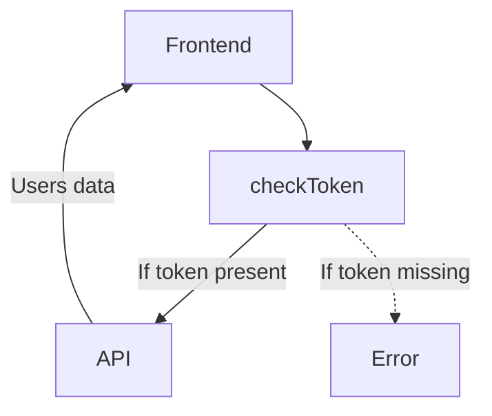
*This diagram illustrates the token validation and authorized API request flow for user data.*
Sources: [src/services/user-service.ts:15-45]()

---

## UI Integration and Protected Routes

- The `AuthContext` provides state and permission checks to UI components.
- Components such as user management and admin pages check `hasPermission` to restrict access.
- On logout, all authentication state and tokens are cleared.

```typescript
const logout = () => {
  localStorage.removeItem("token")
  localStorage.removeItem("user")    
  setUser(null);
  setIsAuthenticated(false); 
  axios.post(api + "/v1/auth/sign-out").catch((error)=>{
    console.error("Logout error:", error);
  })   
  navigate("/")
}
```
Sources: [src/contexts/auth-context.tsx:93-102]()

### Example: Protected Route Usage

```typescript
const { hasPermission } = useAuth()
const isAdmin = hasPermission(ROLES.ADMIN)
return (
  <>
    {isAdmin && <UserManagement />}
  </>
)
```
Sources: [src/pages/user.tsx:7-18]()

---

## Error Handling

- The `handleError` utility processes Axios errors, logs details, and redirects to login on 401 errors.

```typescript
export const handleError = (error: any) => {
  if (axios.isAxiosError(error)) {
    const err = error.response;
    // Logs error details and handles unauthorized access
    if (err?.status == 401) {
      window.history.pushState({}, "LoginPage", "/");
    }
  }
};
```
Sources: [src/lib/handleError.tsx:1-20]()

---

## Summary

Authentication and authorization in this project are built on a robust, modular architecture combining API-driven authentication, React context state management, and strict role-based access control. The system ensures secure, granular access to application features, with clear separation between authentication logic, user management, and UI protection. All flows and permissions are tightly coupled to the role definitions and user model, providing a consistent and extensible foundation for secure application development.

Sources: [src/services/auth-service.ts](), [src/contexts/auth-context.tsx](), [src/types/roles.ts](), [src/services/user-service.ts](), [src/types/User.ts]()

---

<a id='page-6'></a>

## Product and Inventory Management

### Related Pages

Related topics: [UI Components and Layout](#page-10), [Data Flow and State Management](#page-9)

<details>
<summary>Relevant source files</summary>

The following files were used as context for generating this wiki page:

- [src/components/productos/Product-Management.tsx](src/components/productos/Product-Management.tsx)
- [src/components/productos/addProduct.tsx](src/components/productos/addProduct.tsx)
- [src/services/product-service.ts](src/services/product-service.ts)
- [src/contexts/product-context.tsx](src/contexts/product-context.tsx)
- [src/lib/index.ts](src/lib/index.ts)
</details>

# Product and Inventory Management

## Introduction

Product and Inventory Management in this project encompasses the creation, retrieval, filtering, and presentation of product data, as well as category management and inventory tracking. The system provides a centralized context for product state, enables UI components to display and manipulate product information, and interacts with mock or real backend services for persistent data operations. This module is foundational for features such as product listing, searching, filtering, and adding new products. It supports other modules like sales and analytics by ensuring up-to-date product and inventory data.  
Sources: [src/components/productos/Product-Management.tsx](), [src/contexts/product-context.tsx]()

---

## Architecture Overview

The Product and Inventory Management system is composed of several key layers:

- **Product Context Provider:** Supplies product data, categories, and filter logic throughout the application via React context.
- **Service Layer:** Handles data fetching (mock or real) for products.
- **UI Components:** Pages and forms for listing, filtering, and adding products.
- **Data Models:** TypeScript interfaces defining product and related entities.

### Top-Down System Flow

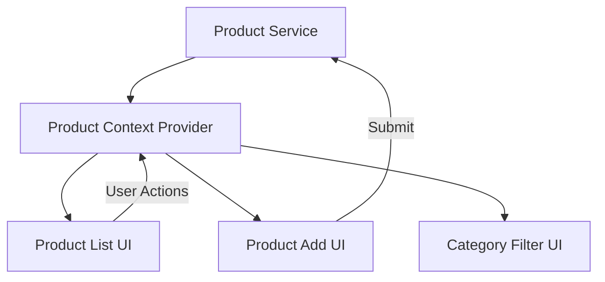
This diagram shows how the service layer, context provider, and UI components interact to deliver product management features.
Sources: [src/contexts/product-context.tsx:1-93](), [src/services/product-service.ts](), [src/components/productos/Product-Management.tsx:1-70](), [src/components/productos/addProduct.tsx:1-80]()

---

## Data Models

The system uses TypeScript interfaces to define the structure of products, categories, and related entities.

### Product Interface

```typescript
export interface Product {
    id: string
    name: string
    code: string
    price: number
    cost: number
    promotionalPrice?: number
    category: string
    stock: number
    minStock?: number
    description?: string
    image?: string
    labelName?: string
    unit: string
    isActive: boolean
    isFavorite: boolean
    createdAt: Date
    updatedAt: Date
}
```
Sources: [src/lib/index.ts:1-20]()

### Category Interface

```typescript
export interface Category {
    id: string
    name: string
    description?: string
}
```
Sources: [src/lib/index.ts:21-25]()

#### Product Data Model Table

| Field            | Type      | Required | Description                          |
|------------------|-----------|----------|--------------------------------------|
| id               | string    | Yes      | Unique product identifier            |
| name             | string    | Yes      | Product name                         |
| code             | string    | Yes      | Product code/SKU                     |
| price            | number    | Yes      | Sale price                           |
| cost             | number    | Yes      | Cost price                           |
| promotionalPrice | number    | No       | Optional promotional price           |
| category         | string    | Yes      | Category name                        |
| stock            | number    | Yes      | Current stock level                  |
| minStock         | number    | No       | Minimum stock for alerting           |
| description      | string    | No       | Product description                  |
| image            | string    | No       | Image URL                            |
| labelName        | string    | No       | Label or brand                       |
| unit             | string    | Yes      | Unit of measure                      |
| isActive         | boolean   | Yes      | Active/inactive status               |
| isFavorite       | boolean   | Yes      | Marked as favorite                   |
| createdAt        | Date      | Yes      | Creation timestamp                   |
| updatedAt        | Date      | Yes      | Last update timestamp                |
Sources: [src/lib/index.ts:1-20]()

---

## Product Context Provider

The `ProductProvider` supplies product data, category lists, search/filter logic, and error/loading state to the rest of the app via React context.

### Key Features

| Feature           | Description                                                  | Source                                      |
|-------------------|-------------------------------------------------------------|---------------------------------------------|
| State Management  | Holds products, categories, search query, filters, loading  | [src/contexts/product-context.tsx:1-93]()   |
| Data Fetching     | Loads products from `fetchProducts()` service               | [src/contexts/product-context.tsx:17-25]()  |
| Filtering         | Filters products by search query and category               | [src/contexts/product-context.tsx:29-36]()  |
| Category Extraction| Generates unique category list from products               | [src/contexts/product-context.tsx:39-40]()  |

#### Context Data Flow

```mermaid
graph TD
  FetchProducts["fetchProducts() Service"] --> ProductProvider
  ProductProvider --> ProductListUI["Product List"]
  ProductProvider --> ProductAddUI["Add Product"]
  ProductProvider --> CategoryListUI["Category List"]
```
The context fetches data via the service, manages state, and provides it to UI components.
Sources: [src/contexts/product-context.tsx:1-93]()

#### Example Context Usage

```typescript
const {
  products,
  filteredProducts,
  categories,
  loading,
  error,
  searchQuery,
  setSearchQuery,
  selectedCategory,
  setSelectedCategory,
} = useProducts()
```
Sources: [src/contexts/product-context.tsx:70-76]()

---

## Product Listing and Filtering

The `ProductsPage` component presents a searchable, filterable list of products, with inventory statistics.

### Main Logic

- Retrieves products and categories (from context or mock data)
- Allows filtering by search term and selected category
- Calculates stock value, cost, estimated profit, and stock levels

#### Filtering Logic Example

```typescript
const filteredProducts = products.filter((product) => {
  const matchesSearch =
    product.name.toLowerCase().includes(searchTerm.toLowerCase()) ||
    product.code.includes(searchTerm);
  const matchesCategory = !selectedCategory || product.category === selectedCategory;
  return matchesSearch && matchesCategory;
});
```
Sources: [src/components/productos/Product-Management.tsx:13-19]()

#### Product Statistics Calculation

- **Total Stock Value:** Sum of `price * stock` for all products
- **Total Cost:** Sum of `cost * stock` for all products
- **Estimated Profit:** `totalValue - totalCost`
- **Low Stock Count:** Products with `stock <= minStock`
- **Out of Stock Count:** Products with `stock === 0`

Sources: [src/components/productos/Product-Management.tsx:21-29]()

#### UI and Data Flow

```mermaid
graph TD
  UserInput["User Search/Filter"] --> ProductsPage
  ProductsPage --> FilterLogic["Filter Products"]
  FilterLogic --> ProductStats["Calculate Stats"]
  FilterLogic --> ProductList["Display List"]
```
Sources: [src/components/productos/Product-Management.tsx:13-34]()

---

## Adding New Products

The `NewProductPage` component provides a form for creating new products.

### Form Data Structure

```typescript
const [formData, setFormData] = useState({
  name: "",
  price: "",
  promotionalPrice: "",
  category: "",
  labelName: "",
  description: "",
  code: "",
  cost: "",
  unit: "Unidad",
  currentStock: "",
  minStock: "",
  trackStock: true,
})
```
Sources: [src/components/productos/addProduct.tsx:10-22]()

### Submission Flow

```mermaid
sequenceDiagram
  participant User
  participant AddProductUI
  participant ProductService

  User ->> AddProductUI: Fill form and submit
  AddProductUI->>AddProductUI: handleSubmit()
  AddProductUI->>ProductService: (future) Save new product
  ProductService-->>AddProductUI: (future) Response/confirmation
  AddProductUI-->>User: Navigate to products page
  Note over AddProductUI: Currently, only logs data and navigates
```
Sources: [src/components/productos/addProduct.tsx:24-36]()

---

## Product Service Layer

The `fetchProducts` function (assumed from naming and context) abstracts the retrieval of product data, enabling the UI and context to be decoupled from the data source (mock or real API).

### Service Usage Example

```typescript
const data = await fetchProducts()
setProducts(data)
```
Sources: [src/contexts/product-context.tsx:19-21](), [src/services/product-service.ts]()

---

## Category Management

Categories are extracted from the list of products and used for filtering.

#### Category Extraction Logic

```typescript
const categories = Array.from(new Set(products.map((product) => product.category)))
```
Sources: [src/contexts/product-context.tsx:39]()

#### Category Data Model Table

| Field       | Type    | Required | Description                 |
|-------------|---------|----------|-----------------------------|
| id          | string  | Yes      | Unique category identifier  |
| name        | string  | Yes      | Category name               |
| description | string  | No       | Optional description        |
Sources: [src/lib/index.ts:21-25]()

---

## Summary

Product and Inventory Management in this system centers around a robust React context provider pattern, TypeScript-based data models, and modular UI components for listing, filtering, and adding products. The architecture cleanly separates concerns between data fetching, state management, and presentation, supporting maintainability and extensibility for future features such as sales integration or analytics.

Sources: [src/components/productos/Product-Management.tsx](), [src/components/productos/addProduct.tsx](), [src/services/product-service.ts](), [src/contexts/product-context.tsx](), [src/lib/index.ts]()

---

<a id='page-7'></a>

## Sales, Transactions, and Payments

### Related Pages

Related topics: [Data Flow and State Management](#page-9)

<details>
<summary>Relevant source files</summary>

The following files were used as context for generating this wiki page:

- [src/components/dashboard.tsx](src/components/dashboard.tsx)
- [src/contexts/cart-context.tsx](src/contexts/cart-context.tsx)
- [src/components/pagos/payment-history.tsx](src/components/pagos/payment-history.tsx)
- [src/components/transaciones/transaciones.tsx](src/components/transaciones/transaciones.tsx)
- [src/hooks/use-transacion.ts](src/hooks/use-transacion.ts)
</details>

# Sales, Transactions, and Payments

## Introduction

The Sales, Transactions, and Payments module is a core part of the project, responsible for managing and displaying sales data, transaction records, and payment histories. It provides interfaces for users to view, filter, and analyze transactional information, supporting key business processes such as order management, payment tracking, and financial reporting. The system is built using React components, custom hooks, and context providers to ensure state consistency and a seamless user experience across the application.

## System Architecture Overview

This module consists of several interconnected React components and hooks that manage the flow of sales and transaction data from the backend (or mock APIs) to the user interface. The architecture is designed to provide real-time updates, role-based access control, and flexible filtering for business operations.

**Mermaid Diagram: High-Level Component Interaction**

```mermaid
graph TD
    Dashboard["Dashboard Component"]
    TransactionsPage["Transactions Page"]
    PaymentHistory["Payment History"]
    CartContext["Cart Context"]
    useTransacion["useTransacion Hook"]

    Dashboard -->|Displays| TransactionsPage
    TransactionsPage -->|Uses| useTransacion
    PaymentHistory -->|Reads| useTransacion
    CartContext -->|Provides| Dashboard
```
*This diagram shows the primary components and their relationships within the sales, transactions, and payments subsystem.*

Sources: [src/components/dashboard.tsx](), [src/components/transaciones/transaciones.tsx](), [src/components/pagos/payment-history.tsx](), [src/contexts/cart-context.tsx](), [src/hooks/use-transacion.ts]()

---

## Transaction Management

### Transactions Page

The `TransactionsPage` component displays a detailed list of all transactions, including sales, returns, refunds, adjustments, and payments. It leverages the `useTransacion` hook to fetch, filter, and update transaction data. The page supports filtering by transaction type, status, and search term, and displays summary statistics using the `TransactionSummaryComponent`.

**Key Features Table**

| Feature                       | Description                                                                                  | Source                                             |
|-------------------------------|----------------------------------------------------------------------------------------------|----------------------------------------------------|
| Transaction List              | Displays transactions with details such as type, status, amount, and date.                   | [src/components/transaciones/transaciones.tsx:1-70]() |
| Filtering                     | Allows filtering by type, status, and search term.                                           | [src/components/transaciones/transaciones.tsx:28-45]() |
| Status Badge                  | Shows visual status indicators for each transaction.                                         | [src/components/transaciones/transaciones.tsx:50-60]() |
| Transaction Summary           | Renders summary statistics on transaction types and statuses.                                | [src/components/transaciones/transaction-summary.tsx:1-60]() |

**Example: Transaction Status Badge Logic**

```javascript
const getStatusBadgeClass = (status: string) => {
  switch (status) {
    case "completed":
      return "bg-success text-white"
    case "pending":
      return "bg-secondary text-white"
    case "failed":
      return "bg-danger text-white"
    case "cancelled":
      return "bg-warning text-dark"
    default:
      return "bg-secondary text-white"
  }
}
```
Sources: [src/components/transaciones/transaciones.tsx:50-60]()

---

### Transaction Data Flow

The flow of transaction data starts from the custom hook `useTransacion`, which manages fetching, updating, and filtering transactions. The hook provides the main data and actions to the UI components.

**Mermaid Sequence Diagram: Transaction Fetch and Display**

```mermaid
sequenceDiagram
    participant UI as TransactionsPage
    participant Hook as useTransacion
    participant API as TransactionsAPI

    UI->>+Hook: Request transactions (with filters)
    Hook->>+API: Fetch transactions
    API-->>-Hook: Return transaction data
    Hook-->>-UI: Provide transactions, summary, update functions
    UI->>UI: Render transaction list and summary
    Note over UI,Hook: UI can trigger updates or status changes via Hook
```
Sources: [src/components/transaciones/transaciones.tsx:1-70](), [src/hooks/use-transacion.ts:1-80]()

---

## Sales Cart Context

The `CartContext` manages the state of the user's shopping cart, including items selected for sale, quantities, and total amounts. This context is essential for the sales workflow, allowing components such as the dashboard and payment modules to access and update cart data consistently.

**Mermaid Diagram: Cart Context Usage**

```mermaid
graph TD
    CartProvider["CartProvider"]
    Dashboard
    PaymentHistory
    TransactionsPage

    CartProvider --> Dashboard
    CartProvider --> PaymentHistory
    CartProvider --> TransactionsPage
```
*CartProvider supplies cart state to all relevant components.*

Sources: [src/contexts/cart-context.tsx](), [src/components/dashboard.tsx](), [src/components/pagos/payment-history.tsx]()

---

## Payment History

The `PaymentHistory` component displays a chronological list of all payment transactions. It utilizes the transaction data provided by the `useTransacion` hook, showing payment amounts, dates, and statuses.

**Key Data Model Table: Transaction Fields**

| Field         | Type      | Description                      | Source                                         |
|---------------|-----------|----------------------------------|------------------------------------------------|
| id            | string    | Unique transaction identifier    | [src/hooks/use-transacion.ts:10-15]()          |
| type          | string    | Transaction type (sale, refund)  | [src/hooks/use-transacion.ts:10-15]()          |
| status        | string    | Transaction status               | [src/hooks/use-transacion.ts:10-15]()          |
| amount        | number    | Transaction amount               | [src/hooks/use-transacion.ts:10-15]()          |
| paymentMethod | string    | Payment method used              | [src/hooks/use-transacion.ts:10-15]()          |
| date          | Date      | Transaction date                 | [src/hooks/use-transacion.ts:10-15]()          |

**Example: Rendering Payment History Item**

```javascript
<div>
  <span>{transaction.reference}</span>
  <span>{formatCurrency(transaction.amount)}</span>
  <span>{formatDate(transaction.date)}</span>
  <span className={getStatusBadgeClass(transaction.status)}>{transaction.status}</span>
</div>
```
Sources: [src/components/pagos/payment-history.tsx:15-30]()

---

## Role-Based Access and Display

The system uses role-based controls to determine which users can access transaction and payment information. For example, only users with certain roles can view the transactions page or access sensitive financial data.

**Code Snippet: Role Guard Usage**

```javascript
<RoleGuard allowedRoles={["ADMIN", "PROPIETARIO"]} currentUserRole={currentUserRole}>
  {/* Protected Content */}
</RoleGuard>
```
Sources: [src/components/transaciones/transaciones.tsx:18-22]()

---

## Summary Table: Main Components and Their Responsibilities

| Component / Hook              | Responsibility                                         | Source                                        |
|-------------------------------|-------------------------------------------------------|-----------------------------------------------|
| TransactionsPage              | Display/filter transactions, show summary             | [src/components/transaciones/transaciones.tsx]() |
| useTransacion                 | Fetch, filter, and update transaction data            | [src/hooks/use-transacion.ts]()               |
| CartContext                   | Manage cart state for sales                           | [src/contexts/cart-context.tsx]()             |
| PaymentHistory                | Display payment records                               | [src/components/pagos/payment-history.tsx]()  |
| TransactionSummaryComponent   | Show transaction statistics and breakdowns            | [src/components/transaciones/transaction-summary.tsx]() |
| RoleGuard                     | Enforce role-based UI access                          | [src/components/transaciones/transaciones.tsx]() |

---

## Conclusion

The Sales, Transactions, and Payments module integrates multiple React components, hooks, and context providers to deliver a robust system for managing and visualizing business transactions. With support for real-time data, filtering, role-based access, and comprehensive summaries, this subsystem is vital for business operations and financial oversight within the project.

Sources: [src/components/dashboard.tsx](), [src/contexts/cart-context.tsx](), [src/components/pagos/payment-history.tsx](), [src/components/transaciones/transaciones.tsx](), [src/hooks/use-transacion.ts]()

---

<a id='page-8'></a>

## Sales Analytics and Reporting

### Related Pages

Related topics: [Sales, Transactions, and Payments](#page-7)

<details>
<summary>Relevant source files</summary>

The following files were used as context for generating this wiki page:

- [src/components/historia-ventas/record-ventas.tsx](src/components/historia-ventas/record-ventas.tsx)
- [src/hooks/use-analytics.ts](src/hooks/use-analytics.ts)
- [src/lib/mock-analytics-api.ts](src/lib/mock-analytics-api.ts)
- [src/types/analytics.ts](src/types/analytics.ts)
- [src/pages/ventasH.tsx](src/pages/ventasH.tsx)
</details>

# Sales Analytics and Reporting

## Introduction

Sales Analytics and Reporting in this project provides a comprehensive set of features for tracking, analyzing, and displaying sales data. The system enables users (primarily admins and owners) to view historical sales records, key metrics, and performance indicators such as top products, top customers, and hourly sales trends. This module is tightly integrated with user roles and permissions, ensuring that only authorized users can access sensitive sales analytics data. The analytics layer leverages a mock API to simulate real-world data aggregation and reporting.

Sources: [src/components/historia-ventas/record-ventas.tsx](), [src/hooks/use-analytics.ts](), [src/lib/mock-analytics-api.ts](), [src/types/analytics.ts](), [src/pages/ventasH.tsx]()

---

## Architecture Overview

The Sales Analytics and Reporting feature is built around React hooks, context providers, and mock API services that together deliver analytics data and sales history to authorized UI components. The architecture ensures separation of concerns between data fetching, state management, and presentation.

### High-Level Data Flow

```mermaid
graph TD
  A[User Interaction] --> B[UI Components]
  B --> C[useAnalytics/useSalesHistory Hooks]
  C --> D[mock-analytics-api]
  D --> E[Mock Data/Transactions]
  C --> F[Component State]
  F --> B
```
*Explanation: User actions in the UI trigger hooks, which fetch data from the mock API and update component state for rendering.*
Sources: [src/hooks/use-analytics.ts:1-80](), [src/lib/mock-analytics-api.ts:1-200]()

---

## Core Components and Hooks

### useAnalytics Hook

The `useAnalytics` hook is responsible for fetching aggregated sales analytics, including overall stats, top products, top customers, top sellers, and hourly sales. It manages loading and error states and provides a refetch method for updating analytics data based on date or user context.

#### Key Features

| Feature            | Description                                                      |
|--------------------|------------------------------------------------------------------|
| Analytics Periods  | Provides stats for today, yesterday, this week, and this month   |
| Top Products       | Lists top-selling products with ranking                          |
| Top Customers      | Lists customers with highest purchase totals                     |
| Top Sellers        | Ranks sellers by sales performance                               |
| Hourly Sales       | Breaks down sales by hour with best/worst hour flags             |
| Loading/Error      | Manages async state and error reporting                          |
| Refetch            | Allows reloading analytics for a given date or user              |

Sources: [src/hooks/use-analytics.ts:1-80]()

#### Example Usage

```typescript
const {
  analytics,
  topProducts,
  topCustomers,
  topSellers,
  hourlySales,
  loading,
  error,
  refetch,
} = useAnalytics(userId)
```
Sources: [src/hooks/use-analytics.ts:22-60]()

### useSalesHistory Hook

The `useSalesHistory` hook fetches and filters detailed sales records. It supports filtering by search term, seller, customer, date range, and sale type, and manages loading and error states.

#### Example Usage

```typescript
const { salesHistory, loading, fetchSalesHistory } = useSalesHistory(selectedSeller)
```
Sources: [src/hooks/use-analytics.ts:61-95]()

---

## Data Models

All analytics and sales history features rely on well-defined TypeScript interfaces.

### Key Data Structures

| Name               | Fields (Type)                                                                                 | Description                              |
|--------------------|----------------------------------------------------------------------------------------------|------------------------------------------|
| SalesStats         | billing, sales, averageTicket, profit, salesRate, paymentMethodPercentage, bestMonth          | Aggregated stats for a period            |
| TopProduct         | id, name, totalSales, rank                                                                    | Product ranking by sales                 |
| TopCustomer        | id, name, totalPurchases, rank                                                                | Customer ranking by purchases            |
| TopSeller          | id, name, totalSales, rank                                                                    | Seller ranking by sales                  |
| HourlySales        | hour, billing, sales, averageTicket, isBestHour, isWorstHour                                  | Sales breakdown per hour                 |
| AnalyticsPeriod    | today, yesterday, thisWeek, thisMonth (SalesStats)                                            | Aggregated stats for each period         |
| SaleRecord         | id, code, date, customer, seller, itemsCount, total, type, observations, status               | Detailed sale transaction record         |
| SalesHistoryFilters| search, sellerId, customerId, dateFrom, dateTo, type                                          | Filters for sales history queries        |

Sources: [src/types/analytics.ts:1-60]()

#### Example: SaleRecord Interface

```typescript
export interface SaleRecord {
  id: string
  code: string
  date: Date
  customer: { id: string; name: string }
  seller: { id: string; name: string }
  itemsCount: number
  total: number
  type: "sale" | "return" | "exchange"
  observations?: string
  status: "completed" | "pending" | "cancelled"
}
```
Sources: [src/types/analytics.ts:28-44]()

---

## Mock Analytics API

The `analyticsApi` object simulates backend analytics endpoints. It aggregates, filters, and processes mock transaction data to provide analytics and reporting functionality.

### Available API Methods

| Method                   | Parameters                                | Description                                      |
|--------------------------|-------------------------------------------|--------------------------------------------------|
| getAnalytics             | date: Date, userId?: string               | Returns period analytics for a user/date          |
| getTopProducts           | limit?: number, userId?: string           | Returns ranked top products                       |
| getTopCustomers          | limit?: number, userId?: string           | Returns ranked top customers                      |
| getTopSellers            | limit?: number                            | Returns ranked top sellers                        |
| getHourlySales           | date: Date, userId?: string               | Returns hourly sales breakdown                    |
| getSalesHistory          | filters: SalesHistoryFilters               | Returns filtered list of sale records             |

Sources: [src/lib/mock-analytics-api.ts:1-200]()

#### Example: getSalesHistory Filtering Logic

```typescript
if (filters.search) {
  const searchTerm = filters.search.toLowerCase()
  filteredSales = filteredSales.filter(
    (sale) =>
      sale.customer.name.toLowerCase().includes(searchTerm) ||
      sale.seller.name.toLowerCase().includes(searchTerm) ||
      sale.code.toLowerCase().includes(searchTerm),
  )
}
```
Sources: [src/lib/mock-analytics-api.ts:120-130]()

### Sequence Diagram: Analytics Data Fetch

```mermaid
sequenceDiagram
  participant UI as SalesHistoryPage
  participant Hook as useSalesHistory
  participant API as analyticsApi
  participant Store as transactionsApi

  UI->>+Hook: fetchSalesHistory(filters)
  Hook->>+API: getSalesHistory(filters)
  API->>+Store: getTransactions()
  Store-->>API: transactions[]
  API-->>-Hook: SaleRecord[]
  Hook-->>-UI: salesHistory
  Note over UI,Hook: UI displays filtered sales history
```
Sources: [src/components/historia-ventas/record-ventas.tsx:1-80](), [src/hooks/use-analytics.ts:61-95](), [src/lib/mock-analytics-api.ts:100-150]()

---

## UI Integration and Role-Based Access

Sales analytics and reporting features are exposed via React components, notably the `SalesHistoryPage`. Access is guarded by user roles, ensuring only users with `ADMIN` or `PROPIETARIO` roles can view sales history.

### RoleGuard Usage Example

```tsx
<RoleGuard allowedRoles={["ADMIN", "PROPIETARIO"]} currentUserRole={currentUserRole}>
  {/* Sales history content */}
</RoleGuard>
```
Sources: [src/components/historia-ventas/record-ventas.tsx:17-70]()

### Main Page Integration

The analytics and sales history UI is rendered on the `/ventasH` page, with sidebar navigation and authentication checks:

```tsx
{isAdmin && ( 
  <div>
    <Sidebar />
    <div className="flex-grow-1  p-4">
      <RecordVentas/>                     
    </div>
  </div>
)}
```
Sources: [src/pages/ventasH.tsx:7-25]()

---

## Hourly Sales Analysis

The analytics API provides a breakdown of sales by hour, flagging the best and worst sales hours for each day.

### Example: Hourly Sales Calculation

```typescript
const hourlySales = Array.from({ length: 24 }, (_, hour) => {
  const hourSales = daySales.filter((sale) => sale.createdAt.getHours() === hour)
  const billing = hourSales.reduce((sum, sale) => sum + sale.amount, 0)
  const salesCount = hourSales.length
  const averageTicket = salesCount > 0 ? billing / salesCount : 0

  return {
    hour,
    billing,
    sales: salesCount,
    averageTicket,
  }
})
```
Sources: [src/lib/mock-analytics-api.ts:70-80]()

### Mermaid Diagram: Hourly Sales Flow

```mermaid
graph TD
  A[Get Transactions]
  B[Filter by Date]
  C[Group by Hour]
  D[Calculate Billing/Sales]
  E[Flag Best/Worst Hour]
  F[Return HourlySales[]]

  A --> B --> C --> D --> E --> F
```
Sources: [src/lib/mock-analytics-api.ts:60-90]()

---

## Summary Table: Main Analytics Features

| Feature                | Hook/API Method           | Data Structure         | UI Component                | Source Files                          |
|------------------------|--------------------------|-----------------------|-----------------------------|---------------------------------------|
| Period Analytics       | useAnalytics, getAnalytics| AnalyticsPeriod       | -                           | use-analytics.ts, mock-analytics-api.ts|
| Top Products           | useAnalytics, getTopProducts| TopProduct          | -                           | use-analytics.ts, mock-analytics-api.ts|
| Top Customers          | useAnalytics, getTopCustomers| TopCustomer        | -                           | use-analytics.ts, mock-analytics-api.ts|
| Top Sellers            | useAnalytics, getTopSellers| TopSeller           | -                           | use-analytics.ts, mock-analytics-api.ts|
| Hourly Sales           | useAnalytics, getHourlySales| HourlySales         | -                           | use-analytics.ts, mock-analytics-api.ts|
| Sales History          | useSalesHistory, getSalesHistory| SaleRecord      | SalesHistoryPage            | use-analytics.ts, record-ventas.tsx, mock-analytics-api.ts|
| Role-Based Access      | -                        | -                    | RoleGuard, ventasH.tsx       | record-ventas.tsx, ventasH.tsx         |

Sources: [src/hooks/use-analytics.ts](), [src/lib/mock-analytics-api.ts](), [src/types/analytics.ts](), [src/components/historia-ventas/record-ventas.tsx](), [src/pages/ventasH.tsx]()

---

## Conclusion

The Sales Analytics and Reporting module is a well-structured, role-protected subsystem that aggregates, filters, and presents sales data in multiple formats. It leverages custom hooks and a mock analytics API to provide robust insights into sales trends, top performers, and transaction histories. Its architecture supports extensibility and clear separation between data, logic, and presentation, ensuring maintainability and scalability within the project.

Sources: [src/components/historia-ventas/record-ventas.tsx](), [src/hooks/use-analytics.ts](), [src/lib/mock-analytics-api.ts](), [src/types/analytics.ts](), [src/pages/ventasH.tsx]()

---

<a id='page-9'></a>

## Data Flow and State Management

### Related Pages

Related topics: [Architecture Overview](#page-3), [Sales, Transactions, and Payments](#page-7), [Product and Inventory Management](#page-6)

<details>
<summary>Relevant source files</summary>

The following files were used as context for generating this wiki page:

- [src/contexts/auth-context.tsx](src/contexts/auth-context.tsx)
- [src/hooks/use-analytics.ts](src/hooks/use-analytics.ts)
- [src/hooks/use-users.ts](src/hooks/use-users.ts)
- [src/lib/mock-analytics-api.ts](src/lib/mock-analytics-api.ts)
- [src/lib/mock-users-api.ts](src/lib/mock-users-api.ts)
- [src/types/analytics.ts](src/types/analytics.ts)
- [src/lib/index.ts](src/lib/index.ts)
</details>

# Data Flow and State Management

## Introduction

This page details the data flow and state management architecture in the posmad project, focusing on how user, analytics, and related business data are managed across the application. The system uses React context providers and custom hooks for local and global state, and relies on mock API modules to simulate backend data operations. This ensures a modular, testable, and scalable frontend structure for managing authentication, analytics, users, and business entities.

## Core Architecture Overview

The application’s data and state flow is organized around three primary layers:
- **Context Providers**: Deliver global state (e.g., authentication) using React’s context API.
- **Custom Hooks**: Encapsulate logic for data fetching, transformation, and state updates (e.g., `useAnalytics`, `useUsers`).
- **Mock API Modules**: Provide asynchronous data operations mimicking backend APIs for analytics and user management.

The following diagram shows the high-level data flow:

```mermaid
graph TD
  AuthContext["Auth Context Provider"]
  AnalyticsHook["useAnalytics Hook"]
  UsersHook["useUsers Hook"]
  MockAnalyticsAPI["mock-analytics-api"]
  MockUsersAPI["mock-users-api"]
  Components["React Components"]

  AuthContext --> Components
  AnalyticsHook --> Components
  UsersHook --> Components
  AnalyticsHook --> MockAnalyticsAPI
  UsersHook --> MockUsersAPI
```
*This diagram illustrates how global state and data are delivered to React components, with hooks acting as intermediaries to mock API modules.*  
Sources: [src/contexts/auth-context.tsx](), [src/hooks/use-analytics.ts](), [src/hooks/use-users.ts](), [src/lib/mock-analytics-api.ts](), [src/lib/mock-users-api.ts]()

---

## Authentication State Management

### AuthContext

- **Purpose:** Provides global authentication state, user info, and role-based permissions.
- **Core State:**
  - `user`: The authenticated user object or `null`
  - `token`: JWT or session token for API calls
  - `isAuthenticated`: Boolean flag
  - `userRole`: Current user's role
- **Key Methods:**
  - `loginUser(email, password)`: Handles login
  - `register(name, email, password, role, enabled)`: Handles registration
  - `logout()`: Clears user and token state
  - `hasPermission(requiredRole)`: Checks role-based permissions
  - `getAccessToken()`: Retrieves the current token

```typescript
const [user, setUser] = useState<User | null>(null)
const [token, setToken] = useState<string | null>(null)
const [isAuthenticated, setIsAuthenticated] = useState(false)
```
Sources: [src/contexts/auth-context.tsx:13-36]()

#### Authentication Data Flow

```mermaid
sequenceDiagram
  participant User
  participant AuthContext
  participant LocalStorage
  participant API

  User->>+AuthContext: loginUser()
  AuthContext->>+API: POST /tokens
  API-->>-AuthContext: Token, user data
  AuthContext->>+LocalStorage: Store user, token
  LocalStorage-->>-AuthContext: (confirm)
  AuthContext-->>-User: isAuthenticated = true
```
*This diagram shows how authentication state is established and propagated through context and local storage.*  
Sources: [src/contexts/auth-context.tsx:37-109]()

---

## Analytics Data Flow

### useAnalytics Hook

- **Purpose:** Fetches and manages analytics-related data for dashboards and reports.
- **State Managed:**
  - `analytics`: Sales statistics for different periods
  - `topProducts`, `topCustomers`, `topSellers`: Ranked entities
  - `hourlySales`: Hourly breakdowns
  - `loading`, `error`: UI state

- **Data Source:** Calls methods from `analyticsApi` (mock API).

```typescript
const [analytics, setAnalytics] = useState<AnalyticsPeriod | null>(null)
const [topProducts, setTopProducts] = useState<TopProduct[]>([])
const [topCustomers, setTopCustomers] = useState<TopCustomer[]>([])
```
Sources: [src/hooks/use-analytics.ts:8-17]()

#### Analytics Data Fetching Flow

```mermaid
graph TD
  useAnalytics["useAnalytics Hook"]
  analyticsApi["analyticsApi (mock)"]
  setState["setAnalytics, setTopProducts, ..."]

  useAnalytics --> analyticsApi
  analyticsApi --> setState
  setState --> useAnalytics
```
*The hook calls the mock API and updates local state variables.*  
Sources: [src/hooks/use-analytics.ts:19-44](), [src/lib/mock-analytics-api.ts:10-160]()

#### Example: Fetching Analytics

```typescript
const fetchAnalytics = async (date: Date = new Date(), filterUserId?: string) => {
  const [analyticsData, productsData, customersData, sellersData, hourlyData] = await Promise.all([
    analyticsApi.getAnalytics(date, filterUserId),
    analyticsApi.getTopProducts(5, filterUserId),
    analyticsApi.getTopCustomers(5, filterUserId),
    analyticsApi.getTopSellers(),
    analyticsApi.getHourlySales(date, filterUserId),
  ])
  setAnalytics(analyticsData)
  setTopProducts(productsData)
  setTopCustomers(customersData)
  setTopSellers(sellersData)
  setHourlySales(hourlyData)
}
```
Sources: [src/hooks/use-analytics.ts:19-44]()

---

## User Data Flow

### useUsers Hook

- **Purpose:** Manages user data for admin screens, including CRUD operations and filtering by role.
- **State Managed:**
  - `users`: Array of user records
  - `loading`, `error`: UI state

- **Data Source:** Uses `usersApi` (mock API).

```typescript
const [users, setUsers] = useState<User[]>([])
const [loading, setLoading] = useState(true)
const [error, setError] = useState<string | null>(null)
```
Sources: [src/hooks/use-users.ts:60-63]()

#### User Data CRUD Flow

```mermaid
graph TD
  useUsers["useUsers Hook"]
  usersApi["usersApi (mock)"]
  setUsers["setUsers"]

  useUsers --> usersApi
  usersApi --> setUsers
  setUsers --> useUsers
```
*CRUD operations update local state after successful mock API calls.*  
Sources: [src/hooks/use-users.ts:65-108](), [src/lib/mock-users-api.ts:1-75]()

#### Example: Creating a User

```typescript
const createUser = async (userData: CreateUserRequest) => {
  const newUser = await usersApi.createUser(userData)
  setUsers((prev) => [...prev, newUser])
  return newUser
}
```
Sources: [src/hooks/use-users.ts:78-82]()

---

## Data Models and Types

The following data models are used for analytics and user management.

### Analytics Types

| Interface      | Key Fields                                           | Description                     |
|----------------|-----------------------------------------------------|---------------------------------|
| SalesStats     | billing, sales, averageTicket, profit, ...          | Sales summary for a period      |
| TopProduct     | id, name, totalSales, rank                          | Product ranking                 |
| TopCustomer    | id, name, totalPurchases, rank                      | Customer ranking                |
| AnalyticsPeriod| today, yesterday, thisWeek, thisMonth (SalesStats)  | Aggregated period stats         |
| SaleRecord     | id, code, date, customer, seller, itemsCount, ...   | Sales history record            |

Sources: [src/types/analytics.ts:1-54]()

### User Types

| Interface | Key Fields                               | Description                |
|-----------|------------------------------------------|----------------------------|
| User      | id, name, email, role, avatar, ...       | User account information   |
| Customer  | id, name, email, phone, address, ...     | Customer profile           |

Sources: [src/lib/index.ts:1-56]()

---

## Mock API Modules

### mock-analytics-api

- Provides methods for:
  - `getAnalytics`
  - `getTopProducts`
  - `getTopCustomers`
  - `getTopSellers`
  - `getHourlySales`
- Simulates delays and returns filtered, calculated demo data.

### mock-users-api

- Provides methods for:
  - `getUsers`
  - `getUserById`
  - `createUser`
  - `updateUser`
  - `deleteUser`
  - `toggleUserStatus`
- Operates on an in-memory mock user list.

```typescript
export const usersApi = {
  async getUsers(): Promise<User[]> { ... },
  async getUserById(id: string): Promise<User | null> { ... },
  async createUser(data: CreateUserRequest): Promise<User> { ... },
  // ...
}
```
Sources: [src/lib/mock-users-api.ts:76-108]()

---

## Summary Table: Key State and Data Flow Components

| Component/Hook         | Data/State Managed         | Source API           | Used In                |
|------------------------|---------------------------|----------------------|------------------------|
| AuthContext            | user, token, isAuth       | loginAPI, localStorage | All components needing auth |
| useAnalytics           | analytics, rankings, hourly| analyticsApi         | Dashboards, reports    |
| useUsers               | users, user CRUD          | usersApi             | Admin/user screens     |

Sources: [src/contexts/auth-context.tsx](), [src/hooks/use-analytics.ts](), [src/hooks/use-users.ts]()

---

## Conclusion

The posmad project implements a modular, context-driven state management architecture leveraging React context providers, custom hooks, and mock API modules. This approach enables clear separation of concerns, testability, and scalable management of business-critical data such as users and analytics, supporting robust dashboards and administrative interfaces.

Sources: [src/contexts/auth-context.tsx](), [src/hooks/use-analytics.ts](), [src/hooks/use-users.ts](), [src/lib/mock-analytics-api.ts](), [src/lib/mock-users-api.ts](), [src/types/analytics.ts](), [src/lib/index.ts]()

---

<a id='page-10'></a>

## UI Components and Layout

### Related Pages

Related topics: [Component Relationship Diagram](#page-4), [Pages and Routing](#page-11)

<details>
<summary>Relevant source files</summary>

The following files were used as context for generating this wiki page:

- [src/components/layout/sidebar.tsx](src/components/layout/sidebar.tsx)
- [src/components/dashboard.tsx](src/components/dashboard.tsx)
- [src/components/productos/product-card.tsx](src/components/productos/product-card.tsx)
- [src/components/usuarios/user-management.tsx](src/components/usuarios/user-management.tsx)
- [src/components/layout/header.tsx](src/components/layout/header.tsx)
- [src/index.css](src/index.css)
</details>

# UI Components and Layout

## Introduction

The "UI Components and Layout" system in this project establishes the structure, navigation, and visual presentation of the application's user interface. It comprises modular React components for layout (sidebar, header, main content), reusable UI elements (product cards, user management tables), and a CSS layer for consistent styling and responsive design. These components enable role-based navigation, present data-rich dashboards, and provide the foundation for user interaction across the app.  
Sources: [src/components/layout/sidebar.tsx](), [src/components/dashboard.tsx](), [src/components/productos/product-card.tsx](), [src/components/usuarios/user-management.tsx](), [src/index.css]()

---

## Application Layout Architecture

The application's UI layout is organized into three primary regions:

1. **Sidebar:** Provides global navigation with role-based menu items.
2. **Header:** Contains page titles, user profile, and quick actions.
3. **Main Content Area:** Displays context-specific content such as dashboards, product lists, and user management.

This modular approach promotes separation of concerns and reusability across pages.

### Layout Structure Diagram

```mermaid
graph TD
    Sidebar["Sidebar<br/>(Navigation)"]
    Header["Header<br/>(Title & Profile)"]
    MainContent["Main Content<br/>(Dynamic Pages)"]

    Sidebar --> MainContent
    Header --> MainContent
```
The Sidebar and Header are persistent across views, while Main Content changes based on routing.  
Sources: [src/components/dashboard.tsx:1-112](), [src/components/layout/sidebar.tsx:1-80]()

---

## Sidebar Navigation

The sidebar is a vertically-oriented navigation menu that adapts its items based on the user's role. Each menu item includes an icon, label, and optional tooltip. The sidebar supports both compact and expanded states, with responsive behavior for mobile devices.

### Sidebar Menu Item Structure

| Property    | Type       | Description                                      |
|-------------|------------|--------------------------------------------------|
| `href`      | string     | Route path for navigation                        |
| `icon`      | string     | FontAwesome icon class for visual cue            |
| `label`     | string     | Display text for the menu item                   |
| `roles`     | array      | Allowed user roles for visibility                |
| `highlight` | boolean    | Indicates if item should be visually emphasized  |
| `tooltip`   | string     | Optional tooltip text                            |

Sources: [src/components/layout/sidebar.tsx:9-51]()

#### Example Sidebar Menu Item Definition

```typescript
{
  href: "/dashboard",
  icon: "fa-check-circle",
  label: "Vender",
  roles: [ROLES.ADMIN, ROLES.CAJERO, ROLES.ALMACENISTA, ROLES.PROPIETARIO, ROLES.USER],
  highlight: true,
  tooltip: "Vender",
}
```
Sources: [src/components/layout/sidebar.tsx:11-19]()

### Sidebar Rendering Flow

```mermaid
graph TD
    Start["App Init"]
    Auth["Determine User Role"]
    Sidebar["Sidebar Component"]
    MenuItems["Filter Menu Items<br/>by Role"]
    RenderMenu["Render Menu List"]
    Navigation["On Click: Route Change"]

    Start --> Auth
    Auth --> Sidebar
    Sidebar --> MenuItems
    MenuItems --> RenderMenu
    RenderMenu --> Navigation
```
Sources: [src/components/layout/sidebar.tsx:1-80]()

### Sidebar Styling

- Uses `.sidebar` and `.sidebar-item` CSS classes for structure and hover effects.
- Responsive adjustments for mobile devices via media queries.
- Expanded/collapsed width managed by `.sidebar.expanded` class.

```css
.sidebar {
  background-color: var(--secondary-color);
  color: white;
  width: 70px;
  height: 100vh;
  position: fixed;
  left: 0;
  top: 0;
  z-index: 1000;
  display: flex;
  flex-direction: column;
  overflow-x: hidden;
  overflow-y: auto;
  transition: all 0.3s ease;
}
.sidebar.expanded {
  width: 240px;
}
```
Sources: [src/index.css:12-37]()

---

## Header Component

The header sits at the top of the main content area and provides:

- Current page title
- User profile avatar, name, and email
- Quick actions (e.g., Help button)

The header is styled for prominence and clarity, using flex layouts and shadow effects.

### Header Layout

```mermaid
graph TD
    Header["Header"]
    Title["Page Title"]
    Actions["Actions (e.g., Help)"]
    Profile["User Profile<br/>(Avatar, Name, Email)"]

    Header --> Title
    Header --> Actions
    Header --> Profile
```
Sources: [src/components/dashboard.tsx:17-39]()

#### Example Header JSX Snippet

```jsx
<header className="bg-white shadow-sm p-4 flex justify-between items-center">
  <h1 className="text-2xl font-bold text-slate-800">Vender</h1>
  <div className="flex items-center gap-4">
    <button className="flex items-center text-gray-600 gap-1">
      <span className="text-sm">Ayuda</span>
    </button>
    <div className="flex items-center gap-2">
      <div className="bg-slate-700 text-white rounded-full w-10 h-10 flex items-center justify-center">
        {userProfile.avatar}
      </div>
      <div className="text-sm">
        <div className="font-medium">{userProfile.fullname}</div>
        <div className="text-gray-500 text-xs">{userProfile.email}</div>
      </div>
      <FontAwesomeIcon icon={faChevronDown}  className="text-gray-500" />
    </div>
  </div>
</header>
```
Sources: [src/components/dashboard.tsx:17-39]()

---

## Main Content Area

The main content area dynamically renders context-specific pages such as the dashboard, product lists, and user management. It leverages React Router for route-based rendering and ensures content is not obscured by the sidebar using margin adjustments.

### Responsive Content Layout

- Uses `.main-content` and `.main-content.expanded` classes for margin and width adjustments.
- Ensures compatibility with both desktop and mobile via media queries.

```css
.main-content {
  margin-left: 70px;
  min-height: 100vh;
  transition: margin-left 0.3s ease;
}
.main-content.expanded {
  margin-left: 240px;
}
@media (max-width: 767.98px) {
  .main-content {
    margin-left: 0;
  }
  .main-content.expanded {
    margin-left: 0;
  }
}
```
Sources: [src/index.css:54-73]()

---

## Product Card Component

Product cards are reusable UI elements for displaying product information within lists or grids. They emphasize key product attributes and support actions such as adding to cart or viewing details.

### Product Card Structure

| Field          | Type     | Description                       |
|----------------|----------|-----------------------------------|
| Image          | string   | Product image URL or placeholder  |
| Name           | string   | Product display name              |
| Price          | number   | Standard or promotional price     |
| Stock          | number   | Available stock                   |
| Actions        | element  | Buttons for cart or detail view   |

Sources: [src/components/productos/product-card.tsx]()

#### Example Product Card Usage

```jsx
<ProductCard
  product={product}
  onAddToCart={addToCart}
  onViewDetails={() => setSelectedProduct(product)}
/>
```
Sources: [src/components/dashboard.tsx:49-56](), [src/components/productos/product-card.tsx]()

---

## User Management Component

The user management component presents a table of users with administrative actions such as editing, deleting, and toggling status. It supports searching, filtering, and inline actions.

### User Management Table Structure

| Column       | Description             |
|--------------|------------------------|
| Avatar       | User profile image     |
| Name         | User's full name       |
| Email        | User's email address   |
| Role         | User's assigned role   |
| Status       | Active/inactive state  |
| Actions      | Edit, delete, toggle   |

Sources: [src/components/usuarios/user-management.tsx]()

#### Example Table Rendering Flow

```mermaid
graph TD
    UserManagement["User Management"]
    FetchUsers["Fetch Users"]
    RenderTable["Render User Table"]
    Actions["Handle Actions<br/>(Edit/Delete/Toggle)"]

    UserManagement --> FetchUsers
    FetchUsers --> RenderTable
    RenderTable --> Actions
```
Sources: [src/components/usuarios/user-management.tsx]()

---

## Styling and Responsiveness

The UI relies on a set of custom CSS variables and utility classes for theming, spacing, and responsive behavior. Key variables include primary/secondary colors, background, and text colors. Components use these variables for consistent appearance.

### Example CSS Variable Usage

```css
:root {
  --primary-color: #10b981;
  --primary-hover: #059669;
  --secondary-color: #1e293b;
  --light-bg: #f8f9fa;
  --dark-text: #333;
  --light-text: #f8f9fa;
}
```
Sources: [src/index.css:1-8]()

### Responsive Sidebar and Content

The sidebar and main content adjust their layout based on viewport width, ensuring usability across devices.

---

## Component Relationships Overview

```mermaid
graph TD
    App["App"]
    Sidebar["Sidebar"]
    Header["Header"]
    MainContent["Main Content"]
    ProductCard["Product Card"]
    UserManagement["User Management"]

    App --> Sidebar
    App --> Header
    App --> MainContent
    MainContent --> ProductCard
    MainContent --> UserManagement
```
This illustrates how high-level layout components integrate with reusable UI elements.  
Sources: [src/components/dashboard.tsx](), [src/components/layout/sidebar.tsx](), [src/components/productos/product-card.tsx](), [src/components/usuarios/user-management.tsx]()

---

## Summary

The UI Components and Layout system establishes a modular, responsive, and role-aware interface for the application. It leverages React component composition, a robust CSS foundation, and reusable elements to create a consistent user experience. Sidebar navigation, header actions, and dynamic content areas work together to facilitate efficient workflows for different user roles, while specialized components like product cards and user management tables streamline core operations.  
Sources: [src/components/layout/sidebar.tsx](), [src/components/dashboard.tsx](), [src/components/productos/product-card.tsx](), [src/components/usuarios/user-management.tsx](), [src/index.css]()

---

<a id='page-11'></a>

## Pages and Routing

### Related Pages

Related topics: [UI Components and Layout](#page-10)

<details>
<summary>Relevant source files</summary>

The following files were used as context for generating this wiki page:

- [src/App.tsx](src/App.tsx)
- [src/pages/dashboard-layout.tsx](src/pages/dashboard-layout.tsx)
- [src/pages/login.tsx](src/pages/login.tsx)
- [src/pages/productos-page.tsx](src/pages/productos-page.tsx)
- [src/pages/user.tsx](src/pages/user.tsx)
- [src/pages/ventasH.tsx](src/pages/ventasH.tsx)
- [src/pages/transaciones-page.tsx](src/pages/transaciones-page.tsx)
</details>

# Pages and Routing

## Introduction

The "Pages and Routing" system in this project provides the foundation for navigation and rendering of views within the React-based frontend. It leverages React Router for route management, utilizes lazy loading for performance optimization, and organizes the application into feature-based pages. The system is responsible for mapping URL paths to React components, managing authentication context, and orchestrating layout and access control across public and protected areas of the application.  
Sources: [src/App.tsx:1-61]()

## Application Routing Architecture

### Routing Overview

The main routing logic is implemented in `src/App.tsx`, which uses React Router's `BrowserRouter`, `Routes`, and `Route` components. Pages are grouped into public and protected routes, with providers for authentication, user, and application contexts wrapping the routing logic.

**Key Features:**
- Lazy loading of page components for code splitting.
- Context providers for authentication, user, and app-wide state.
- Distinct routes for login, dashboard, products, transactions, user management, and sales history.
- Use of a loading indicator during lazy loading.

**Code Snippet:**  
```tsx
<Router>
  <AuthProvider>
    <UserProvider>
      <AppProvider>
        <Suspense fallback={<Loading />}>
          <Routes>
            {/* Public routes */}
            <Route path="/" element={<LoginPage />} />
            <Route path="/user" element={<UsersPage />} />
            <Route path="/transaciones" element={<Transaciones />} />
            <Route path="/productos" element={<ProductsPage />} />
            <Route path="/productos/addProduct" element={<AddProduct />} />
            <Route path="/historia-ventas" element={<HistorialVentas />} />
            {/* Protected routes */}
            <Route path="/dashboard" element={<DashboardLayout />}>
              <Route index element={<HomePage />} />
              {/* ... */}
```
Sources: [src/App.tsx:1-61]()

### Mermaid Diagram: Routing Flow

The following diagram illustrates the top-down flow of the routing logic:

```mermaid
graph TD
    A[App Entry] --> B[BrowserRouter]
    B --> C[AuthProvider]
    C --> D[UserProvider]
    D --> E[AppProvider]
    E --> F[Suspense (Loading)]
    F --> G[Routes]
    G --> H1[Route "/"]
    G --> H2[Route "/user"]
    G --> H3[Route "/transaciones"]
    G --> H4[Route "/productos"]
    G --> H5[Route "/productos/addProduct"]
    G --> H6[Route "/historia-ventas"]
    G --> H7[Route "/dashboard"]
    H7 --> I[DashboardLayout (Protected)]
    I --> J[HomePage (index)]
```
This diagram shows the hierarchical composition of providers and the routing structure, with both public and protected routes.  
Sources: [src/App.tsx:1-61]()

### Route Table

| Path                     | Component             | Access        | Description                      | Source                   |
|--------------------------|----------------------|---------------|----------------------------------|--------------------------|
| `/`                      | LoginPage            | Public        | Login view                       | [src/App.tsx:21]()       |
| `/user`                  | UsersPage            | Public        | User management                  | [src/App.tsx:22]()       |
| `/transaciones`          | Transaciones         | Public        | Transactions page                | [src/App.tsx:23]()       |
| `/productos`             | ProductsPage         | Public        | Product listing                  | [src/App.tsx:24]()       |
| `/productos/addProduct`  | AddProduct           | Public        | Add product form                 | [src/App.tsx:25]()       |
| `/historia-ventas`       | HistorialVentas      | Public        | Sales history                    | [src/App.tsx:26]()       |
| `/dashboard`             | DashboardLayout      | Protected     | Main dashboard layout            | [src/App.tsx:28-29]()    |
| `/dashboard` (index)     | HomePage             | Protected     | Dashboard home                   | [src/App.tsx:30]()       |
Sources: [src/App.tsx:1-61]()

## Page Components Overview

### Dashboard Layout

The `DashboardLayout` is a lazily loaded component that serves as the protected area for authenticated users. It acts as a container for further nested routes, such as the dashboard home page.

**Key Points:**
- Wrapped in a `<Route path="/dashboard" element={<DashboardLayout />}>`.
- Renders the home page as its index route.
- Intended for further extension with additional protected child routes.

Sources: [src/App.tsx:28-31](), [src/pages/dashboard-layout.tsx]()

### Login Page

The `LoginPage` component is mapped to the root path `/` and provides the authentication entry point for users.

Sources: [src/App.tsx:21](), [src/pages/login.tsx]()

### Products Page

The `ProductsPage` handles product listings and is accessible via `/productos`. The route `/productos/addProduct` loads the product creation form.

Sources: [src/App.tsx:24-25](), [src/pages/productos-page.tsx]()

### User Management Page

The `UsersPage` component is available at `/user`, supporting user management features.

Sources: [src/App.tsx:22](), [src/pages/user.tsx]()

### Sales History Page

The `HistorialVentas` component is mapped to `/historia-ventas` for viewing the sales history.

Sources: [src/App.tsx:26](), [src/pages/ventasH.tsx]()

### Transactions Page

The `Transaciones` component provides the transactions view at `/transaciones`.

Sources: [src/App.tsx:23](), [src/pages/transaciones-page.tsx]()

## Routing and Lazy Loading

The application uses React's `lazy` and `Suspense` for code-splitting and on-demand loading of page components, enhancing performance by only loading code for routes when needed.

**Code Snippet:**  
```tsx
const DashboardLayout = lazy(() => import("./pages/dashboard-layout"))
const HomePage = lazy(() => import("./pages/home"))
const ProductsPage = lazy(() => import("./pages/productos-page"))
const Transaciones = lazy(() => import("./pages/transaciones-page"))
const AddProduct = lazy(() => import("./components/productos/addProduct"))
const UsersPage = lazy(() => import("./pages/user"))
const HistorialVentas = lazy(() => import("./pages/ventasH"))
```
Sources: [src/App.tsx:7-14]()

**Explanation:**  
When a route is matched, the corresponding component is loaded asynchronously. The `Suspense` component provides a fallback (`<Loading />`) during this process.

## Data Flow and Context Integration

### Context Providers

The routing system is wrapped with several context providers, ensuring that authentication, user state, and application-wide state are available throughout the page components.

```mermaid
graph TD
    A[App] --> B[AuthProvider]
    B --> C[UserProvider]
    C --> D[AppProvider]
    D --> E[Routes]
```
This ensures that every page rendered via routing has access to the necessary global context for authentication and user management.  
Sources: [src/App.tsx:2-17]()

### Sequence Diagram: Navigation to a Protected Page

```mermaid
sequenceDiagram
    participant User
    participant Browser
    participant App
    participant AuthProvider
    participant DashboardLayout

    User->>Browser: Navigate to /dashboard
    Browser->>App: Render App
    App->>AuthProvider: Check authentication
    AuthProvider-->>App: Authenticated/Not Authenticated
    App->>DashboardLayout: Render if authenticated
    DashboardLayout-->>User: Dashboard page
    Note over AuthProvider,App: If not authenticated, redirect logic applies (not shown in provided code)
```
Sources: [src/App.tsx:1-61](), [src/pages/dashboard-layout.tsx]()

## Page Component Summary Table

| Component         | File                          | Purpose                          | Lazy Loaded | Route Path            | Source                   |
|-------------------|------------------------------|-----------------------------------|-------------|-----------------------|--------------------------|
| LoginPage         | src/pages/login.tsx           | User authentication              | No          | `/`                   | [src/App.tsx:21]()       |
| DashboardLayout   | src/pages/dashboard-layout.tsx| Dashboard container              | Yes         | `/dashboard`          | [src/App.tsx:28]()       |
| HomePage          | src/pages/home.tsx            | Dashboard home                   | Yes         | `/dashboard` (index)  | [src/App.tsx:30]()       |
| ProductsPage      | src/pages/productos-page.tsx  | Product listing                  | Yes         | `/productos`          | [src/App.tsx:24]()       |
| AddProduct        | src/components/productos/addProduct.tsx | Add product form     | Yes         | `/productos/addProduct`| [src/App.tsx:25]()       |
| UsersPage         | src/pages/user.tsx            | User management                  | Yes         | `/user`               | [src/App.tsx:22]()       |
| HistorialVentas   | src/pages/ventasH.tsx         | Sales history                    | Yes         | `/historia-ventas`    | [src/App.tsx:26]()       |
| Transaciones      | src/pages/transaciones-page.tsx| Transactions                     | Yes         | `/transaciones`       | [src/App.tsx:23]()       |
Sources: [src/App.tsx:1-61](), [src/pages/*]()

## Conclusion

The Pages and Routing module in this project is designed for clarity, scalability, and performance. It provides a well-structured, context-aware navigation system, employing code-splitting and clear separation between public and protected routes. Each route is mapped to a feature-specific page component, ensuring maintainability and ease of future extension.  
Sources: [src/App.tsx](), [src/pages/dashboard-layout.tsx](), [src/pages/login.tsx](), [src/pages/productos-page.tsx](), [src/pages/user.tsx](), [src/pages/ventasH.tsx](), [src/pages/transaciones-page.tsx]()

---

<a id='page-12'></a>

## Deployment and Configuration

### Related Pages

Related topics: [Getting Started](#page-2)

<details>
<summary>Relevant source files</summary>

The following files were used as context for generating this wiki page:

- [package.json](package.json)
- [vite.config.ts](vite.config.ts)
- [tsconfig.node.json](tsconfig.node.json)
- [tsconfig.app.json](tsconfig.app.json)
- [README.md](README.md)
</details>

# Deployment and Configuration

## Introduction

This page provides a comprehensive overview of the deployment and configuration processes for the project, focusing on development, build, and runtime settings. The project leverages React, TypeScript, and Vite, with additional tooling for linting and code quality. Configuration is managed through several JSON and TypeScript files, ensuring maintainable, scalable, and reproducible environments for both development and production. This documentation is grounded solely in the referenced configuration and setup files.

## Project Structure Overview

The project is structured to separate concerns between application source code, configuration, and build tooling. Key configuration files include `package.json` for dependencies and scripts, `vite.config.ts` for build and dev server configuration, and `tsconfig` files for TypeScript settings.

```mermaid
graph TD
    A[package.json] --> B[Dependencies]
    A --> C[Scripts]
    D[vite.config.ts] --> E[Vite Plugins & Server]
    F[tsconfig.app.json] --> G[App TypeScript Config]
    H[tsconfig.node.json] --> I[Node TypeScript Config]
    J[README.md] --> K[ESLint & Linting Setup]
```
*This diagram illustrates the relationships between configuration files and their main responsibilities within the project.*
Sources: [package.json:1-53](), [vite.config.ts:1-18](), [tsconfig.app.json:1-33](), [tsconfig.node.json:1-29](), [README.md:1-68]()

## Scripts and Dependency Management

### NPM Scripts

The `package.json` file defines scripts for common tasks such as development, building, linting, and previewing the built application.

| Script   | Command                          | Description                          |
|----------|----------------------------------|--------------------------------------|
| dev      | vite                             | Start development server             |
| build    | tsc -b && vite build             | TypeScript build, then Vite build    |
| lint     | eslint .                         | Run ESLint on all files              |
| preview  | vite preview                     | Preview production build             |

Sources: [package.json:7-14]()

### Dependencies

Key dependencies and devDependencies include:

- **React**: UI library (`react`, `react-dom`)
- **Vite**: Build tool and dev server (`vite`, `@vitejs/plugin-react`)
- **TypeScript**: Static typing (`typescript`, `@types/*`)
- **ESLint**: Linting and code quality (`eslint`, `@eslint/js`, `eslint-plugin-react-hooks`, etc.)
- **UI/Styling**: Bootstrap, Tailwind, FontAwesome

Sources: [package.json:15-53]()

## Vite Configuration

The Vite configuration is defined in `vite.config.ts`. This file sets up the React plugin, path aliasing, and dev server options.

```typescript
import { defineConfig } from 'vite'
import react from '@vitejs/plugin-react'

export default defineConfig({
  plugins: [react()],
  resolve: {  
    alias: {
      "@": "/src",
    },
  },
  server: {
    port: 3000,
    open: true,
  },
})
```
- **Plugins**: Uses `@vitejs/plugin-react` for React Fast Refresh and other optimizations.
- **Alias**: Maps `@` to `/src` for simpler imports.
- **Server**: Runs on port 3000 and opens browser on start.

Sources: [vite.config.ts:1-18]()

### Vite Server Flow

```mermaid
graph TD
    A[Start Dev Server] --> B[Load Vite Config]
    B --> C[Apply React Plugin]
    B --> D[Set Alias @ -> /src]
    B --> E[Configure Server: port 3000, open browser]
    E --> F[Serve Application]
```
*This flow shows how the Vite dev server initializes using the configuration settings.*
Sources: [vite.config.ts:1-18]()

## TypeScript Configuration

The project uses two TypeScript configuration files to handle different build targets: one for the application (`tsconfig.app.json`) and one for Node scripts (`tsconfig.node.json`).

### tsconfig.app.json

- **Target**: ES2020
- **Libs**: ES2020, DOM, DOM.Iterable
- **Module**: ESNext
- **JSX**: react-jsx
- **Strict**: true
- **NoEmit**: true (TypeScript does not emit JS; handled by Vite)
- **Linting**: Enforces strict type checks and disables unchecked side effect imports

```json
{
  "compilerOptions": {
    "target": "ES2020",
    "lib": ["ES2020", "DOM", "DOM.Iterable"],
    "module": "ESNext",
    "skipLibCheck": true,
    "moduleResolution": "bundler",
    "allowImportingTsExtensions": true,
    "verbatimModuleSyntax": true,
    "moduleDetection": "force",
    "noEmit": true,
    "jsx": "react-jsx",
    "strict": true,
    "noUnusedLocals": true,
    "noUnusedParameters": true,
    "noFallthroughCasesInSwitch": true,
    "noUncheckedSideEffectImports": true
  },
  "include": ["src"]
}
```
Sources: [tsconfig.app.json:1-33]()

### tsconfig.node.json

- **Target**: ES2022
- **Libs**: ES2023
- **Module**: ESNext
- **NoEmit**: true
- **Linting**: Similar strict options as `tsconfig.app.json`
- **Includes**: Only Vite config file

Sources: [tsconfig.node.json:1-29]()

### TypeScript Configuration Relationships

```mermaid
graph TD
    A[tsconfig.app.json] -->|Includes| B[src/]
    C[tsconfig.node.json] -->|Includes| D[vite.config.ts]
    A --> E[App Build]
    C --> F[Node Scripts/Build]
```
*This diagram highlights how each TypeScript config targets different parts of the project.*
Sources: [tsconfig.app.json:1-33](), [tsconfig.node.json:1-29]()

## ESLint and Linting Configuration

Linting is set up via scripts in `package.json` and configuration guidance in `README.md`. ESLint is used with recommended and React-specific plugins.

- **Script**: `npm run lint` runs ESLint on all files.
- **Plugins**: Supports `@eslint/js`, `eslint-plugin-react-hooks`, `eslint-plugin-react-refresh`, and others.
- **Recommended Config**: The README suggests using type-aware rules and optionally installing additional plugins for React.

#### Example ESLint Configuration (from README.md)

```js
export default tseslint.config({
  extends: [
    ...tseslint.configs.recommendedTypeChecked,
    ...tseslint.configs.strictTypeChecked,
    ...tseslint.configs.stylisticTypeChecked,
  ],
  languageOptions: {
    parserOptions: {
      project: ['./tsconfig.node.json', './tsconfig.app.json'],
      tsconfigRootDir: import.meta.dirname,
    },
  },
})
```
Sources: [README.md:9-30]()

### Linting Process Flow

```mermaid
graph TD
    A[Run npm run lint] --> B[ESLint Loads Config]
    B --> C[Apply TypeScript & React Rules]
    C --> D[Analyze Source Files]
    D --> E[Report Issues]
```
Sources: [README.md:9-68](), [package.json:12]()

## Build and Deployment Process

The project build and deployment flow is managed via npm scripts and Vite.

### Build Steps

1. **TypeScript Build**: `tsc -b` compiles TypeScript for type checking only (no emit).
2. **Vite Build**: `vite build` bundles the application for production.

### Build Process Sequence

```mermaid
sequenceDiagram
    participant Dev as Developer
    participant NPM as NPM Scripts
    participant TSC as TypeScript Compiler
    participant Vite as Vite Builder

    Dev->>NPM: Run npm run build
    NPM->>TSC: tsc -b
    TSC-->>NPM: Type checking completed
    NPM->>Vite: vite build
    Vite-->>NPM: Production bundle created
```
*This sequence illustrates the build process as defined in the npm scripts.*
Sources: [package.json:9](), [tsconfig.app.json:1-33](), [vite.config.ts:1-18]()

## Configuration Options Summary

| File                | Key Options/Fields      | Description                                                  |
|---------------------|------------------------|--------------------------------------------------------------|
| package.json        | scripts, dependencies  | Scripts for dev/build/lint; lists dependencies               |
| vite.config.ts      | plugins, alias, server | React plugin, path alias, dev server port and auto-open      |
| tsconfig.app.json   | compilerOptions, include | TypeScript options for app code, JSX, strictness            |
| tsconfig.node.json  | compilerOptions, include | TypeScript options for Node scripts, strictness             |
| README.md           | ESLint config examples | Guidance for linting, recommended plugins, type-aware rules  |

Sources: [package.json:1-53](), [vite.config.ts:1-18](), [tsconfig.app.json:1-33](), [tsconfig.node.json:1-29](), [README.md:1-68]()

## Conclusion

The deployment and configuration system for this project is centered around modern tooling—Vite for build and dev server, TypeScript for type safety, and ESLint for code quality. All configuration is managed through clearly structured files, enabling consistent environments for development and production. This robust setup ensures maintainability, scalability, and developer efficiency throughout the project lifecycle.

Sources: [package.json](), [vite.config.ts](), [tsconfig.app.json](), [tsconfig.node.json](), [README.md]()

---

<a id='page-13'></a>

## Extensibility and Customization

### Related Pages

Related topics: [Authentication and Authorization](#page-5)

<details>
<summary>Relevant source files</summary>

The following files were used as context for generating this wiki page:

- [src/lib/mock-users-api.ts](src/lib/mock-users-api.ts)
- [src/services/user-service.ts](src/services/user-service.ts)
- [src/components/usuarios/user-management.tsx](src/components/usuarios/user-management.tsx)
- [src/contexts/auth-context.tsx](src/contexts/auth-context.tsx)
- [src/lib/mock-analytics-api.ts](src/lib/mock-analytics-api.ts)
- [src/hooks/use-users.ts](src/hooks/use-users.ts)
</details>

# Extensibility and Customization

## Introduction

Extensibility and customization within this project focus on how the user management and analytics modules can be adapted, extended, or configured to suit varying business requirements. The architecture leverages mock APIs, service layers, React hooks, and context providers to facilitate modularity and the ability to inject custom logic or data sources. This approach enables rapid prototyping, testing, and future expansion, supporting both static and dynamic user and analytics data flows.

The following sections describe the extensibility mechanisms, key customizable components, and the flow of data and control, as evidenced by the user and analytics modules. For more on related topics, see [User Management](#user-management) and [Analytics Module](#analytics-module).

---

## Core Extensibility Points

### 1. Mock API Layer

Both user and analytics functionalities are abstracted behind mock API objects (`usersApi`, `analyticsApi`). This allows for easy swapping between mock data and real backend endpoints.

#### Key Features

| Component        | Description                                                                                 | Source                                      |
|------------------|--------------------------------------------------------------------------------------------|---------------------------------------------|
| `usersApi`       | Provides CRUD methods for user data with simulated delay and error handling.                | [src/lib/mock-users-api.ts:1-100]()         |
| `analyticsApi`   | Exposes analytics retrieval and aggregation with customizable periods and filters.          | [src/lib/mock-analytics-api.ts:1-100]()     |

##### Example: Mock Users API

```typescript
export const usersApi = {
  async getUsers(): Promise<User[]> {
    await delay(500)
    return [...mockUsers]
  },
  async createUser(data: CreateUserRequest): Promise<User> {
    await delay(800)
    // ... logic ...
  },
  // ...
}
```
Sources: [src/lib/mock-users-api.ts:21-60]()

#### Flowchart: Mock API Request Flow

```mermaid
graph TD
  UI["UI Component"]
  Hook["Custom Hook (use-users)"]
  Service["Service Layer"]
  MockAPI["Mock API (usersApi/analyticsApi)"]
  Data["Mock Data Array"]
  UI --> Hook
  Hook --> Service
  Service --> MockAPI
  MockAPI --> Data
  Data --> MockAPI
  MockAPI --> Service
  Service --> Hook
  Hook --> UI
```
Sources: [src/lib/mock-users-api.ts](), [src/hooks/use-users.ts](), [src/services/user-service.ts]()

---

### 2. Service Layer Abstraction

The `user-service.ts` module acts as an intermediary between components/hooks and the underlying API, abstracting token management, error handling, and response mapping. This design allows swapping out mock APIs for real endpoints or injecting additional logic (e.g., logging, validation) without modifying UI components.

#### Service Layer Example

```typescript
export async function fetchUsers(): Promise<User[]> {
  const accessToken = checkToken()
  try {
    const response = await api.get("/v1/users", {
      headers: { Authorization: `Bearer ${accessToken}` }
    })
    // ...mapping logic...
    return mappedUsers
  } catch (error) {
    // ...error handling...
    return []
  }
}
```
Sources: [src/services/user-service.ts:14-46]()

#### Table: Service Layer Methods

| Method             | Purpose                              | Customizable Aspects              | Source                          |
|--------------------|--------------------------------------|-----------------------------------|---------------------------------|
| `fetchUsers`       | Fetches all users                    | Token source, API endpoint, mapping| [src/services/user-service.ts]()|
| `fetchUserById`    | Fetches a user by ID                 | URL pattern, response mapping     | [src/services/user-service.ts]()|
| `createUser`       | Creates a new user                   | Payload schema, error handling    | [src/services/user-service.ts]()|

---

### 3. React Hooks for Data and State Management

Custom hooks (e.g., `use-users.ts`) encapsulate logic for fetching, mutating, and filtering data. This separation allows developers to override or extend data-fetching logic, add caching, or connect to alternative data sources without altering UI components.

#### Example: useUsers Hook

```typescript
const { users, loading, error, createUser, updateUser, deleteUser, toggleUserStatus, refetch } = useUsers()
```
Sources: [src/hooks/use-users.ts:1-65]()

#### Flowchart: User Data Flow via Hook

```mermaid
graph TD
  Component["User Management Component"]
  useUsers["useUsers Hook"]
  usersApi["usersApi / Service Layer"]
  DataSource["Mock or Real Data Source"]
  Component --> useUsers
  useUsers --> usersApi
  usersApi --> DataSource
```
Sources: [src/components/usuarios/user-management.tsx](), [src/hooks/use-users.ts]()

---

### 4. Context Provider for Authentication and User State

The `AuthProvider` context manages user state, authentication tokens, and permission logic. This provider can be extended to support new authentication flows, third-party logins, or additional permission checks.

#### Key Features

- Centralized state for user, token, and loading status.
- Exposes customizable registration and login functions.
- Provides a permission-checking utility (`hasPermission`).

#### Code Snippet: Auth Context Provider

```typescript
const AuthContext = createContext<AuthContextType | undefined>(undefined)

export function AuthProvider({ children }: { children: ReactNode }) {
  const [user, setUser] = useState<User | null>(null)
  const [token, setToken] = useState<string | null>(null)
  // ...
}
```
Sources: [src/contexts/auth-context.tsx:1-45]()

---

### 5. Extensible Role and Permission Model

Roles and permissions are defined and mapped within the mock user data and utility functions, allowing easy addition of new roles, permissions, and access rules.

#### Table: Example Role Permissions

| Role           | Permissions (Examples)                                  | Source                                 |
|----------------|---------------------------------------------------------|----------------------------------------|
| admin          | `*` (all)                                               | [src/lib/mock-users-api.ts:10-15]()    |
| propietario    | User/product/sales management, analytics, settings      | [src/lib/mock-users-api.ts:20-35]()    |
| cajero         | Sales and customer access                               | [src/lib/mock-users-api.ts:40-45]()    |
| almacenista    | Inventory, products, suppliers, inventory reports       | [src/lib/mock-users-api.ts:50-55]()    |
| user           | Read-only access                                        | [src/lib/mock-users-api.ts:60-65]()    |

#### Mermaid: Role-Permission Relationship

```mermaid
graph TD
  Admin["admin"]
  Propietario["propietario"]
  Cajero["cajero"]
  Almacenista["almacenista"]
  User["user"]
  AllPerms["*"]
  Admin --> AllPerms
  Propietario -->|users.create| AllPerms
  Cajero -->|sales.read| AllPerms
  Almacenista -->|inventory.*| AllPerms
  User -->|products.read| AllPerms
```
Sources: [src/lib/mock-users-api.ts:1-70]()

---

## User Management

The user management module is designed for extensibility by allowing new user roles, customizable CRUD operations, and integration with both mock and real APIs. The UI components (e.g., `user-management.tsx`) consume the hook/service abstraction, making it straightforward to alter business logic or data sources.

#### Sequence Diagram: User Creation Flow

```mermaid
sequenceDiagram
  participant UI as User Management UI
  participant Hook as useUsers Hook
  participant Service as User Service
  participant MockAPI as usersApi
  UI->>+Hook: createUser(data)
  Hook->>+Service: createUser(data)
  Service->>+MockAPI: createUser(data)
  MockAPI-->>-Service: New User Object
  Service-->>-Hook: New User Object
  Hook-->>-UI: Update users state
  Note over Hook,Service: Error handling at each layer
```
Sources: [src/components/usuarios/user-management.tsx](), [src/hooks/use-users.ts](), [src/services/user-service.ts](), [src/lib/mock-users-api.ts]()

---

## Analytics Module

The analytics module follows a similar extensibility pattern, exposing its logic via a mock API (`analyticsApi`) and custom hooks. This setup allows for easy integration of additional analytics providers, data visualizations, or aggregation logic.

#### Mermaid: Analytics Data Flow

```mermaid
graph TD
  AnalyticsUI["Analytics UI"]
  useAnalytics["useAnalytics Hook"]
  analyticsApi["analyticsApi"]
  MockData["Mock Analytics Data"]
  AnalyticsUI --> useAnalytics
  useAnalytics --> analyticsApi
  analyticsApi --> MockData
```
Sources: [src/lib/mock-analytics-api.ts](), [src/hooks/use-analytics.ts]()

---

## Customization Strategies

- **Swap Mock APIs with Real Endpoints:** Replace the mock API implementations with real HTTP requests as needed in the service layer.
- **Extend Data Models:** Add new fields or roles in the mock data and update corresponding TypeScript types.
- **Override Hooks:** Create custom hooks that wrap or extend the default ones for more advanced use cases.
- **Modify Permission Logic:** Update role-permission mappings in the mock API or context provider to reflect changing business rules.

---

## Conclusion

The project’s extensibility and customization are enabled by clear separation between UI, hooks, service layers, and mock APIs. This modularity supports rapid prototyping and straightforward migration to production data sources. By centralizing configuration and logic in service and context layers, developers can easily adapt the system to new requirements, roles, or data flows.

Sources: [src/lib/mock-users-api.ts](), [src/services/user-service.ts](), [src/components/usuarios/user-management.tsx](), [src/contexts/auth-context.tsx](), [src/lib/mock-analytics-api.ts](), [src/hooks/use-users.ts]()

---

